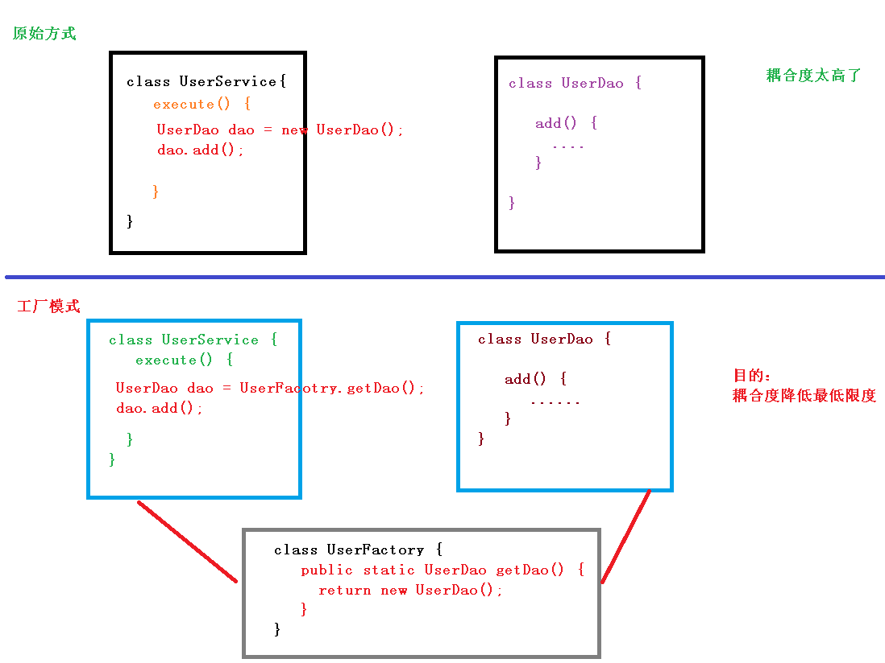
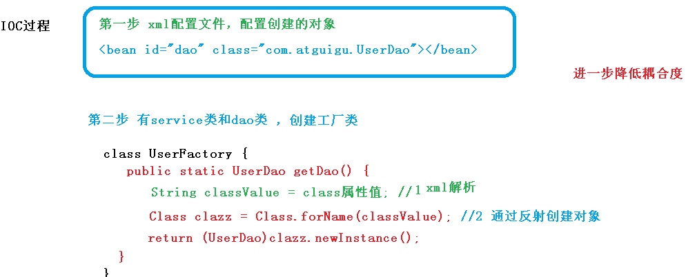
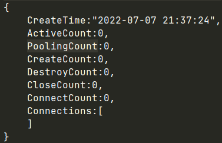
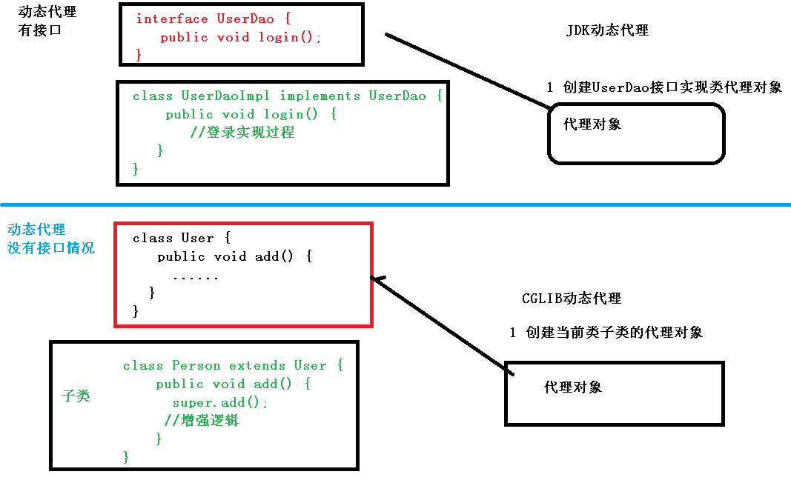
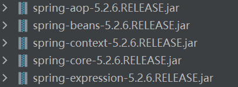
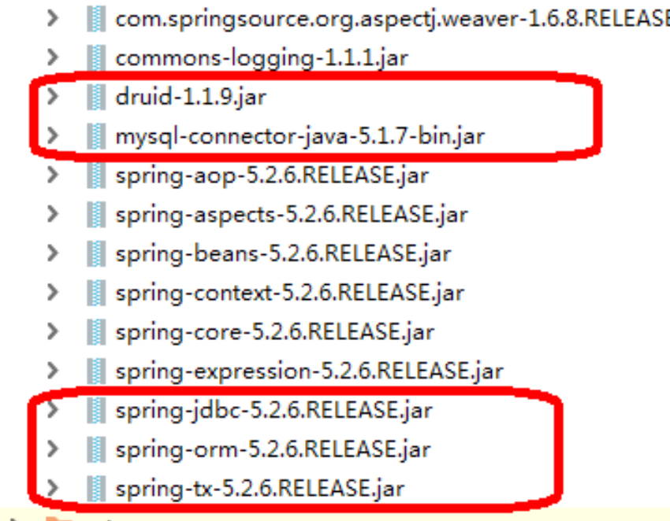
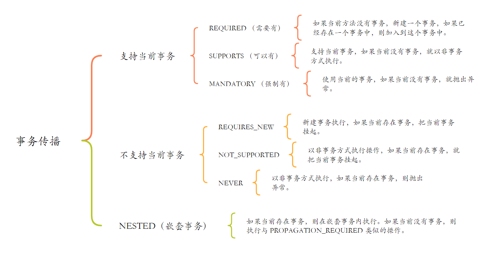

# 0 Spring的概述

1. Spring 是轻量级的开源的 JavaEE 框架 

2. Spring 可以解决企业应用开发的复杂性 

3. Spring 有两个核心部分：IOC 和 Aop 
   1. IOC：控制反转，把创建对象过程交给 Spring 进行管理 
   2. Aop：面向切面，不修改源代码进行功能增强 

4. Spring 特点 
   1. 方便解耦，简化开发
   2. Aop 编程支持
   3. 方便程序测试
   4. 方便和其他框架进行整合 
   5. 方便进行事务操作 
   6. 降低 API 开发难度

# 1 IOC容器-底层原理

## 1.1 什么是IOC？

控制反转：把对象创建和对象之间的调用过程，交给Spring进行管理

使用IOC目的：为了降低耦合度

降低耦合度的两种方式：



## 1.2 IOC底层原理 

xml解析、工厂模式、反射

## 1.3 画图理解IOC底层原理



## 1.4 IOC接口

个人总结：ioc就是做了两件事情，一是关于配置文件的，使用配置见描述bean以及bean之间的依赖关系，二是利用java反射机制实例化bean和建立bean之间的依赖关系。

1. IOC 思想基于 IOC 容器完成，IOC 容器底层就是对象工厂

2. Spring提供IOC容器实现两种方式：（两个接口）

   1. BeanFactory：IOC容器基本实现，是Spring内部的使用接口，不提供开发人员使用。

      **加载配置文件时不会创建对象，在获取对象（使用）时才会创建对象。**

   2. ApplicationContext：BeanFactory接口的子接口，提供更多更强大的功能，一般由开发人员使用。

      **加载配置文件时就会把配置文件中的对象进行创建。**

3. ApplicationContext接口有实现类

   

# 2 IOC操作-Bean管理

## 2.1 什么是Bean管理

Bean管理指的是两个操作：

* Spring创建对象
* Spring注入属性

Bean 管理操作有两种方式：

* 基于 xml 配置文件方式实现 
* 基于注解方式实现

## 2.2 Bean管理 – 基于XML方式

### 2.2.1 基于XML方式创建对象

```xml
<?xml version="1.0" encoding="UTF-8"?>
<beans xmlns="http://www.springframework.org/schema/beans"
       xmlns:xsi="http://www.w3.org/2001/XMLSchema-instance"
       xsi:schemaLocation="http://www.springframework.org/schema/beans http://www.springframework.org/schema/beans/spring-beans.xsd">
    <!--配置User的bean-->
    <bean id="user" class="com.yuyunhu.demo.User"/>
</beans>
```

1. 在 spring 配置文件中，使用 bean 标签，标签里面添加对应属性，就可以实现对象创建
2. 在 bean 标签有很多属性，介绍常用的属性
   * id 属性：唯一标识 
   * class 属性：类全路径（包类路径）
3. 创建对象时候，默认也是执行无参数构造方法完成对象创建

### 2.2.2 基于XML方式注入属性

DI：依赖注入，就是注入属性，是IOC的一种实现

#### 2.2.2.1 第一种注入方式：使用Set方法注入

1. 创建类，定义属性和对象的Set方法

   ```java
   /*
   演示使用set方法注入属性
    */
   public class Book {
       // 创建属性
       private String bname;
       private String bauthor;
   
       // 1. Set方法注入
       public void setBname(String bname) {
           this.bname = bname;
       }
   
       public void setBauthor(String bauthor) {
           this.bauthor = bauthor;
       }
   }
   ```

2. 在Spring配置文件配置对象创建，配置属性注入

   ```xml
   <?xml version="1.0" encoding="UTF-8"?>
   <beans xmlns="http://www.springframework.org/schema/beans"
          xmlns:xsi="http://www.w3.org/2001/XMLSchema-instance"
          xsi:schemaLocation="http://www.springframework.org/schema/beans http://www.springframework.org/schema/beans/spring-beans.xsd">
       <!--  set方法注入属性 -->
       <bean id="book" class="com.yuyunhu.demo.Book">
           <!--
           name:类里面的属性名称
           value: 向属性注入值
           -->
           <property name="bname" value="三体"/>
           <property name="bauthor" value="莫言"/>
       </bean>
   </beans>
   ```

3. 测试

   ```java
   public void test() {
       // 1. 加载spring配置文件
       ApplicationContext applicationContext = new ClassPathXmlApplicationContext("beanConfig.xml"); // 默认是在src下
       // 2. 获取配置创建的对象
       Book book = applicationContext.getBean("book", Book.class);
       System.out.println(book);
   }
   ```

#### 2.2.2.2 第二种注入方式：使用有参构造注入

1. 创建类，定义属性，创建属性对应的有参构造方法

   ```java
   public class Orders {
       private String oname;
       private String address;
   
       // 有参构造
       public Orders(String oname, String address) {
           this.oname = oname;
           this.address = address;
       }
   }
   ```

2. 在Spring配置文件中进行配置

   ```xml
   <?xml version="1.0" encoding="UTF-8"?>
   <beans xmlns="http://www.springframework.org/schema/beans"
          xmlns:xsi="http://www.w3.org/2001/XMLSchema-instance"
          xsi:schemaLocation="http://www.springframework.org/schema/beans http://www.springframework.org/schema/beans/spring-beans.xsd">
       <bean id="orders" class="com.yuyunhu.demo.Orders">
           <!--  -->
           <constructor-arg index="0" value="电脑"/>
           <constructor-arg index="1" value="湖北武汉"/>
       </bean>
   </beans>
   ```

#### 2.2.2.3 第三种注入方式：P名称空间注入

可以简化基于XML配置方式

1. 添加p名称空间在配置文件中

   

2. 属性注入

```xml
<?xml version="1.0" encoding="UTF-8"?>
<beans xmlns="http://www.springframework.org/schema/beans"
       xmlns:xsi="http://www.w3.org/2001/XMLSchema-instance"
       xmlns:p="http://www.springframework.org/schema/p"
       xsi:schemaLocation="http://www.springframework.org/schema/beans http://www.springframework.org/schema/beans/spring-beans.xsd">
    <!-- xmlns:p="http://www.springframework.org/schema/p" -->
    <bean id="book" class="com.yuyunhu.demo.Book" p:bname="九阳神功"/>
</beans>
```

### 2.2.3 基于XML方式注入其他类型的属性

#### 2.2.3.1 注入字面量

- null值

  ```xml
  <property name="address">
      <null/>
  </property>
  ```

- 属性中包含特殊符号

  ```xml
  <!-- 属性中包含特殊字符
      1. 把<>进行转义 &lt; &gt;
      2. 把特殊符号写到CDATA
  -->
  <property name="address">
      <!-- 如果直接写 <<南京>> 会报错-->
      <!-- <value><<南京>></value>-->
      <value><![CDATA[<<南京>>]]></value>
  </property>
  ```

#### 2.2.3.2 注入外部Bean

- 创建两个类Service类和Dao类

- 在service类中调用Dao里面的方法

- 在Spring配置文件中进行配置

  ```java
  public class UserService {
      private UserDao userDao;
      public void update() {
          System.out.println("service update");
          userDao.update();
      }
      // set方法必须要有，否则xml无法将userDao注入
      public void setUserDao(UserDao userDao) {
          this.userDao = userDao;
      }
  }
  ```

  ```java
  public class UserDao {
      public void update() {
          System.out.println("userdao update...");
      }
  }
  ```

  ```xml
  <bean id="userDao" class="com.yuyunhu.demo.dao.UserDao"/>
  <bean id="userService" class="com.yuyunhu.demo.service.UserService">
      <property name="userDao" ref="userDao"/>
  </bean>
  ```

#### 2.2.3.3 注入内部Bean和级联赋值

- 一对多关系：部门和员工

  一个部门有过个员工，一个员工属于一个部门

- 在实体类之间表示一对多关系，员工表示所属部门，使用对象类型属性进行表示

1. 创建部门和员工实体类

   ```java
   public class Dept {
       private String dname;
   
       public void setDname(String dname) {
           this.dname = dname;
       }
   }
   ```

   ```java
   public class Emp {
       private String name;
       private String gender;
       private Dept dept;
   
       public void setName(String name) {
           this.name = name;
       }
   
       public void setGender(String gender) {
           this.gender = gender;
       }
   
       public void setDept(Dept dept) {
           this.dept = dept;
       }
   }
   ```

2. xml配置

   ```xml
   <?xml version="1.0" encoding="UTF-8"?>
   <beans xmlns="http://www.springframework.org/schema/beans"
          xmlns:xsi="http://www.w3.org/2001/XMLSchema-instance"
          xsi:schemaLocation="http://www.springframework.org/schema/beans http://www.springframework.org/schema/beans/spring-beans.xsd">
       <!-- 内部bean -->
   
       <bean id="emp" class="com.yuyunhu.demo.entity.Emp">
           <property name="name" value="张三"/>
           <property name="gender" value="女"/>
           <property name="dept">
               <bean id="dept" class="com.yuyunhu.demo.entity.Dept">
                   <property name="dname" value="安保部"></property>
               </bean>
           </property>
       </bean>
       <!-- 级联赋值 -->
       <!--
       <bean id="emp" class="com.yuyunhu.demo.entity.Emp">
           <property name="name" value="张三"/>
           <property name="gender" value="女"/>
           <property name="dept" ref="dept"/>
       </bean>
       <bean id="dept" class="com.yuyunhu.demo.entity.Dept">
           <property name="dname" value="财务部"/>
       </bean>
   	-->
   </beans>
   ```

#### 2.2.3.4 注入集合属性

1. 注入数组类型属性

2. 注入List集合属性

3. 注入Map集合属性

```java
public class Student {
    private String[] courses;
    private List<String> list;
    private Map<String, String> map;
    private Set<String> set;

    public String[] getCourses() {
        return courses;
    }
    public void setCourses(String[] courses) {
        this.courses = courses;
    }
    public void setList(List<String> list) {
        this.list = list;
    }
    public void setMap(Map<String, String> map) {
        this.map = map;
    }
    public void setSet(Set<String> set) {
        this.set = set;
    }
}
```

```xml
<?xml version="1.0" encoding="UTF-8"?>
<beans xmlns="http://www.springframework.org/schema/beans"
       xmlns:xsi="http://www.w3.org/2001/XMLSchema-instance"
       xsi:schemaLocation="http://www.springframework.org/schema/beans http://www.springframework.org/schema/beans/spring-beans.xsd">
    <bean id="student" class="com.yuyunhu.demo.entity.Student">
        <property name="courses">
            <array>
                <value>Java</value>
                <value>数据库</value>
            </array>
        </property>
        <property name="list">
            <list>
                <value>张三</value>
                <value>王五</value>
            </list>
        </property>
        <property name="map">
            <map>
                <entry key="java" value="java课程"/>
                <entry key="php" value="php课程"/>
            </map>
        </property>
        <property name="set">
            <set>
                <value>Mysql</value>
                <value>Redis</value>
            </set>
        </property>
    </bean>
</beans>
```

#### 2.2.3.5 注入集合属性–在集合中设置对象类型的值

创建Course类

```java
public class Course {
    private String cname;
    public void setCname(String cname) {
        this.cname = cname;
    }
}
```

在上例的Student类中添加属性

```java
private List<Course> courseList;

public void setCourseList(List<Course> courseList) {
    this.courseList = courseList;
}
```

在xml中配置

```xml
<?xml version="1.0" encoding="UTF-8"?>
<beans xmlns="http://www.springframework.org/schema/beans"
       xmlns:xsi="http://www.w3.org/2001/XMLSchema-instance"
       xsi:schemaLocation="http://www.springframework.org/schema/beans http://www.springframework.org/schema/beans/spring-beans.xsd">
    <bean id="course1" class="com.yuyunhu.demo.entity.Course">
        <property name="cname" value="JavaEE"/>
    </bean>
    <bean id="course2" class="com.yuyunhu.demo.entity.Course">
        <property name="cname" value="Mysql高级"/>
    </bean>
    <bean id="student" class="com.yuyunhu.demo.entity.Student">
        <property name="courseList">
            <list>
                <ref bean="course1"/>
                <ref bean="course2"/>
            </list>
        </property>
    </bean>
</beans>
```

#### 2.2.3.6 输入集合属性–把集合注入部分提取出来

1. 在spring配置文件中引入命名空间

   ```xml
   <?xml version="1.0" encoding="UTF-8"?>
   <beans xmlns="http://www.springframework.org/schema/beans"
          xmlns:xsi="http://www.w3.org/2001/XMLSchema-instance"
          xmlns:util="http://www.springframework.org/schema/util"
          xsi:schemaLocation="http://www.springframework.org/schema/beans http://www.springframework.org/schema/beans/spring-beans.xsd
           http://www.springframework.org/schema/util https://www.springframework.org/schema/util/spring-util.xsd">
   </beans>
   ```

2. 使用util标签完成list集合注入提取

   ```xml
   <!--1 提取 list 集合类型属性注入-->
   <util:list id="listStr">
       <value>111</value>
       <value>222</value>
   </util:list>
   <!--2 提取 list 集合类型属性注入使用-->
   <bean id="student" class="com.yuyunhu.demo.entity.Student">
       <property name="list" ref="listStr"/>
   </bean>
   ```

### 2.2.4 FactoryBean

Spring 有两种Bean，一种是普通Bean，一种是工厂Bean（FactoryBean）

1. 普通Bean：在spring配置文件中，定义bean类型就是返回类型（比如定义的是Book类，返回的就是Book的Bean）

2. 工厂bean：在配置文件中定义bean类型可以和返回类型不一样

   第一步：创建类，让这个类作为工厂bean，实现接口FactoryBean

   第二步：实现接口里面的方法，在实现的方法中定义返回的bean类型

   ```java
   public class MyBean implements FactoryBean<Object> {
       // 定义返回 Bean
       @Override
       public Course getObject() throws Exception {
           Course course = new Course();
           course.setCname("111");
           return course;
       }
   
       @Override
       public Class<?> getObjectType() {
           return null;
       }
   }
   ```

   第三步：在配置文件中配置

   ```xml
   <?xml version="1.0" encoding="UTF-8"?>
   <beans xmlns="http://www.springframework.org/schema/beans"
          xmlns:xsi="http://www.w3.org/2001/XMLSchema-instance"
          xsi:schemaLocation="http://www.springframework.org/schema/beans http://www.springframework.org/schema/beans/spring-beans.xsd">
   
       <bean id="mybean" class="com.yuyunhu.demo.service.MyBean"/>
   </beans>
   ```

   ```java
   public void testMyBean() {
       ApplicationContext context = new ClassPathXmlApplicationContext("bean2.xml");
       Course course = context.getBean("mybean", Course.class);
       System.out.println(course);
   }
   ```

### 2.2.5 Bean作用域

1. 在Spring里面，设置创建bean实力是单实例还是多实例

2. 在spring中，默认情况下，bean是单实例对象

   通过对象的地址值来验证一下：地址值一样说明始终是同一个对象

   ```xml
   <bean id="student" class="com.yuyunhu.demo.entity.Student">
       <property name="list">
           <list>
               <value>111</value>
               <value>222</value>
           </list>
       </property>
   </bean>
   ```

   ```java
   public void test1() {
       ApplicationContext context = new ClassPathXmlApplicationContext("bean1.xml");
       Student s1 = context.getBean("student", Student.class);
       Student s2 = context.getBean("student", Student.class);
       System.out.println(s1);
       System.out.println(s2);
   }
   ```

   

3. 如何设置单例或多例？

   - 在 spring 配置文件 bean 标签里面有属性（scope）用于设置单实例还是多实例
   - scope属性值：
     1. 默认值：singleton，表示单实例对象
     2. prototype，表示是多实例对象
   - singleton 和 prototype 区别
     1. singleton 单实例，prototype 多实例
     2. 设置 scope 值是 <font color='red'>singleton</font> 时候，<font color='red'>加载 spring 配置文件时候就会创建单实例对象</font>
     3. 设置 scope 值是 <font color='red'>prototype</font> 时候，不是在加载 spring 配置文件时候创建对象，在 <font color='red'>调用 getBean 方法时候创建多实例对象</font>

   ```xml
   <bean id="student" class="com.yuyunhu.demo.entity.Student" scope="prototype">
       <property name="list">
           <list>
               <value>111</value>
               <value>222</value>
           </list>
       </property>
   </bean>
   ```

   ```java
   public void test1() {
       ApplicationContext context = new ClassPathXmlApplicationContext("bean1.xml");
       Student s1 = context.getBean("student", Student.class);
       Student s2 = context.getBean("student", Student.class);
       System.out.println(s1);
       System.out.println(s2);
   }
   ```

   

### 2.2.6 Bean生命周期

1. 通过构造器创建 bean 实例（无参数构造） 
2. 为 bean 的属性设置值和对其他 bean 引用（调用 set 方法）
3. 调用 bean 的初始化的方法（需要进行配置初始化的方法） 
4. bean 可以使用了（对象获取到了） 
5. 当容器关闭时候，调用 bean 的销毁的方法（需要进行配置销毁的方法）

```java
public class Course {
    private String cname;

    public Course() {
        System.out.println("第一步 执行无参数构造创建 bean 实例");
    }
    public void setCname(String cname) {
        this.cname = cname;
        System.out.println("第二步 调用Set方法设置属性值");
    }
    public void initMethod() {
        System.out.println("第三步 执行初始化的方法");
    }
    public void destroyMethod() {
        System.out.println("第五步 执行销毁的方法");
    }

}
```

```xml
<bean id="course" class="com.yuyunhu.demo.entity.Course" init-method="initMethod" destroy-method="destroyMethod">
    <property name="cname" value="Java"/>
</bean>
```

```java
    public void test2() {
//        ApplicationContext context = new ClassPathXmlApplicationContext("bean1.xml");
        ClassPathXmlApplicationContext context = new ClassPathXmlApplicationContext("bean1.xml");
        context.close(); // ApplicationContext接口中没有close
    }
```

### 2.2.7  Bean的后置处理器

1. 通过构造器创建 bean 实例（无参数构造）
2. 为 bean 的属性设置值和对其他 bean 引用（调用 set 方法） 
3. <font color='red'>把 bean 实例传递 bean 后置处理器的方法 postProcessBeforeInitialization</font>
4. 调用 bean 的初始化的方法（需要进行配置初始化的方法）
5. <font color='red'>把 bean 实例传递 bean 后置处理器的方法 postProcessAfterInitialization </font>
6. bean 可以使用了（对象获取到了）
7. 当容器关闭时候，调用 bean 的销毁的方法（需要进行配置销毁的方法）

```java
public class MyBeanPost implements BeanPostProcessor{
    @Override
    public Object postProcessBeforeInitialization(Object bean, String beanName) throws BeansException {
        System.out.println("在初始化之前执行的方法");
        return BeanPostProcessor.super.postProcessBeforeInitialization(bean, beanName);
    }

    @Override
    public Object postProcessAfterInitialization(Object bean, String beanName) throws BeansException {
        System.out.println("在初始化之后 执行的方法");
        return BeanPostProcessor.super.postProcessAfterInitialization(bean, beanName);
    }
}
```

```xml
<!--配置后置处理器
    对配置文件中所有bean都会有后置处理器操作
-->
<bean id="mybeanpost" class="com.yuyunhu.demo.entity.MyBeanPost"/>
```

```java
public void test3() {
    ClassPathXmlApplicationContext context = new ClassPathXmlApplicationContext("bean1.xml");
    context.close(); 
}
```

### 2.2.8 XML自动装配

#### 2.2.8.1 自动装配？

根据指定装配规则（属性名称或者属性类型），Spring 自动将匹配的属性<font color='red'>值</font>进行注入

#### 2.2.8.2 演示自动装配

```java
public class Dept {
    private String dname;

    public void setDname(String dname) {
        this.dname = dname;
    }

    @Override
    public String toString() {
        return "Dept{" +
                "dname='" + dname + '\'' +
                '}';
    }
}
```

```java
public class Emp {
    private String name;
    private String gender;
    private Dept dept;

    public void setName(String name) {
        this.name = name;
    }

    public void setGender(String gender) {
        this.gender = gender;
    }

    public void setDept(Dept dept) {
        this.dept = dept;
    }

    @Override
    public String toString() {
        return "Emp{" +
                "name='" + name + '\'' +
                ", gender='" + gender + '\'' +
                ", dept=" + dept +
                '}';
    }
}
```

1. 根据属性名称自动注入

   ```xml
   <!--    手动装配-->
   <!--    <bean id="emp" class="com.yuyunhu.demo.entity.Emp">-->
   <!--        <property name="dept" ref="dept"/>-->
   <!--    </bean>-->
   <!--    <bean id="dept" class="com.yuyunhu.demo.entity.Dept"/>-->
   
   <!--    自动装配
   bean 标签属性 autowire，配置自动装配
    autowire 属性常用两个值：
    byName 根据属性名称注入 ，注入值 bean 的 id 值和类属性名称一样
    byType 根据属性类型注入
   -->
   <bean id="emp" class="com.yuyunhu.demo.entity.Emp" autowire="byName"/>
   <bean id="dept" class="com.yuyunhu.demo.entity.Dept"/>
   ```

2. 根据属性类型自动注入

   ```java
   <bean id="emp" class="com.yuyunhu.demo.entity.Emp" autowire="byType"/>
   <bean id="dept" class="com.yuyunhu.demo.entity.Dept"/>
   ```

### 2.2.9 外部属性文件（以配置数据库连接池为例）

#### 2.2.9.1 直接配置数据库信息

1. 引入德鲁伊连接池依赖jar包

   

2. 配置德鲁伊连接池

   ```xml
   <bean id="dataSource" class="com.alibaba.druid.pool.DruidDataSource">
       <property name="driverClassName" value="com.mysql.jdbc.Driver"/>
       <property name="url" value="jdbc:mysql://localhost:3306/userDb"/>
       <property name="username" value="root"/>
       <property name="password" value="root"/>
   </bean>
   ```

#### 2.2.9.2 通过引入外部属性文件的方式配置数据库连接池

1. 创建外部属性文件，properties 格式文件，写数据库信息

   ```properties
   prop.driverCLass=com.mysql.jdbc.Driver
   prop.url=jdbc:mysql://localhost:3306/mydb
   prop.username=root
   prop.password=root
   ```

2. 把外部 properties 属性文件引入到 spring 配置文件中

   **引入 context 名称空间**

   ```xml
   <?xml version="1.0" encoding="UTF-8"?>
   <beans xmlns="http://www.springframework.org/schema/beans"
          xmlns:xsi="http://www.w3.org/2001/XMLSchema-instance"
          xmlns:context="http://www.springframework.org/schema/context"
          xsi:schemaLocation="http://www.springframework.org/schema/beans http://www.springframework.org/schema/beans/spring-beans.xsd http://www.springframework.org/schema/context https://www.springframework.org/schema/context/spring-context.xsd">
       <!-- 在 spring 配置文件使用标签引入外部属性文件-->
       <context:property-placeholder location="classpath:jdbc.properties"/>
       <!--配置连接池-->
       <bean id="datasource" class="com.alibaba.druid.pool.DruidDataSource">
           <property name="driverClassName" value="${prop.driverClass}"/>
           <property name="url" value="${prop.url}"/>
           <property name="username" value="${prop.username}"/>
           <property name="password" value="${prop.password}"/>
       </bean>
   </beans>
   ```

   ```java
   public void test5() {
       ApplicationContext context = new ClassPathXmlApplicationContext("jdbcConfig.xml");
       DataSource dataSource = context.getBean("datasource", DataSource.class);
       System.out.println(dataSource);
   }
   ```

   

## 2.3 Bean管理 – 基于注解方式

### 2.3.1 什么是注解

1. 注解是代码特殊标记，格式：@注解名称(属性名称=属性值, 属性名称=属性值..) 
2. 注解作用在类上面，方法上面，属性上面 
3. 使用注解目的：简化 xml 配置

### 2.3.2 Spring 针对 Bean 管理中创建对象提供注解

1. @Component 
2. @Service 
3. @Controller 
4. @Repository

**上面四个注解功能是一样的，都可以用来创建 bean 实例**

### 2.3.3 基于注解方式实现对象创建

1. 引入依赖

   如果不引入依赖会抛出异常：

   > java.lang.NoClassDefFoundError: org/springframework/aop/TargetSource

2. 开启组件扫描

   ```xml
   <?xml version="1.0" encoding="UTF-8"?>
   <beans xmlns="http://www.springframework.org/schema/beans"
          xmlns:xsi="http://www.w3.org/2001/XMLSchema-instance"
          xmlns:context="http://www.springframework.org/schema/context"
          xsi:schemaLocation="http://www.springframework.org/schema/beans http://www.springframework.org/schema/beans/spring-beans.xsd http://www.springframework.org/schema/context https://www.springframework.org/schema/context/spring-context.xsd">
   
       <!--
       开启注解扫描
       1. 如果扫描多个包，多个包使用逗号隔开
       2. 扫描包上层目录
       -->
       <context:component-scan base-package="com.yuyunhu.demo"/>
   </beans>
   ```

   另外还有组件扫描更详细配置如下：

   ```xml
   <!--
    use-default-filters="false" 表示现在不使用默认 filter，自己配置 filter
    context:include-filter ，设置扫描哪些内容
    -->
   <context:component-scan base-package="com.yuyunhu.demo" use-default-filters="false">
       <!-- 只扫描demo下的@Service注解 -->
       <context:include-filter type="annotation" expression="org.springframework.stereotype.Service"/>
   </context:component-scan>
   
   <!--
    扫描包所有内容
    context:exclude-filter： 设置哪些内容不进行扫描
    -->
   <context:component-scan base-package="com.yuyunhu.demo">
       <!-- 不扫描demo下的@Service注解 -->
       <context:exclude-filter type="annotation" expression="org.springframework.stereotype.Service"/>
   </context:component-scan>
   ```

3. 创建类

   ```java
   /*
   在注解里面 value 属性值可以省略不写，
   默认值是类名称，首字母小写
   UserService -- userService
    */
   //@Component(value = "userService")
   //@Repository(value = "userService")
   @Controller(value = "userService")
   //@Service(value = "userService")
   // 以上四个注解都可以使用
   public class UserService {
       public void addUser(){
           System.out.println("add user ... ");
       }
   
   }
   ```

4. 测试

   ```java
   public void test6() {
       ApplicationContext context = new ClassPathXmlApplicationContext("bean3.xml");
       UserService userService = context.getBean("userService", UserService.class);
       userService.addUser();
   }
   ```

### 2.3.4  基于注解方式实现属性注入

#### 2.3.4.1 @Autowired：根据属性类型进行自动装配

1. 创建service和dao类

   ```java
   @Service(value = "userDao")
   public class UserDao {
       public void addUser() {
           System.out.println("dao add user ..");
       }
   }
   ```

   ```java
   @Service(value = "userService")
   public class UserService {
       //定义 dao 类型属性
       //不需要添加 set 方法
       //添加注入属性注解
       @Autowired
       private UserDao userDao;
       public void addUser(){
           System.out.println("service add user ... ");
           userDao.addUser();
       }
   }
   ```

2. 测试一下

   ```java
   public void test6() {
       ApplicationContext context = new ClassPathXmlApplicationContext("bean3.xml");
       UserService userService = context.getBean("userService", UserService.class);
       userService.addUser();
   }
   /*
   service add user ... 
   dao add user ..
   */
   ```

#### 2.3.4.2 @Qualifier：根据名称进行注入

@Qualifier 注解需要和上面@Autowired 一起使用

此注解的应用场景：接口UserDao有两个实现类UserDaoImpl1和UserDaoImpl2，如果需要指定使用其中一个就需要用@Qualifier 注解指定impl的名称

示例如下

```java
public interface UserDao {
    void addUser();
}
```

```java
@Service(value = "userDaoImpl1")
public class UserDaoImpl1 implements UserDao {
    public void addUser() {
        System.out.println("dao add user ..");
    }
}
```

```java
@Service(value = "userDaoImpl2")
public class UserDaoImpl2 implements UserDao {
    public void addUser() {
        System.out.println("dao add user ..");
    }
}
```

```java
@Resource：可以根据类型注入，可以根据名称注入
@Service(value = "userService")
public class UserService {

    @Autowired
    // userDao有两个实现类，如果不加此注解会抛异常：
    // No qualifying bean of type 'xxx.UserDao' available
    @Qualifier(value = "userDaoImpl1")
    private UserDao userDao;
    public void addUser(){
        System.out.println("service add user ... ");
        userDao.addUser();
    }
}
/*
service add user ... 
dao1 add user ..
*/
```

#### 2.3.4.3 @Resource：可以根据类型注入，可以根据名称注入

```java
// @Resource
@Resource(name = "userDaoImpl1")
private UserDao userDao;
public void addUser(){
    System.out.println("service add user ... ");
    userDao.addUser();
}
```

#### 2.3.4.4 @Value：注入普通类型属性

```java
@Value(value = "abc")
private String name;
```

### 2.3.5 完全注解开发

1. 创建配置类

   ```java
   @Configuration
   @ComponentScan(basePackages = {"com.yuyunhu.demo"})
   public class SpringConfig {
   }
   ```

2. 测试类

   ```java
   public void test7() {
       ApplicationContext context = new AnnotationConfigApplicationContext(SpringConfig.class);
       UserService userService = context.getBean("userService", UserService.class);
       userService.addUser();
   }
   ```

# 3 AOP概述

## 3.1 什么是AOP

1. 面向切面编程（方面），利用 AOP 可以对业务逻辑的各个部分进行隔离，从而使得 业务逻辑各部分之间的耦合度降低，提高程序的可重用性，同时提高了开发的效率。 
2. 通俗描述：不通过修改源代码方式，在主干功能里面添加新功能
3. 使用登录例子说明 AOP


# 4 AOP底层原理（<font color='red'>需了解JDK的动态代理</font>）

AOP底层使用动态代理：有两种情况动态代理



## 4.1 有接口情况，使用jdk动态代理

创建接口实现类代理对象，增强类的方法

1. 使用 JDK 动态代理，使用 Proxy 类里面的方法创建代理对象

   调用 newProxyInstance 方法

   

   方法有三个参数：

   -  第一参数，类加载器 
   - 第二参数，增强方法所在的类，这个类实现的接口，支持多个接口 
   - 第三参数，实现这个接口 InvocationHandler，创建代理对象，写增强的部分

2. 编写 JDK 动态代理代码

   创建接口

   ```java
   public interface UserDao {
       void addUser();
       void deleteUser();
   }
   ```

   实现接口实现类，实现接口中的方法

   ```java
   public class UserDaoImpl implements UserDao {
       public void addUser() {
           System.out.println("dao add user ..");
       }
   
       @Override
       public void deleteUser() {
           System.out.println("delete user ... ");
       }
   }
   ```

   使用 Proxy 类创建接口代理对象

   ```java
   public class JDKProxy {
   
       public static void main(String[] args) {
           // 创建接口代理对象
           Class[] interfaces = {UserDao.class};
           UserDao userDao = new UserDaoImpl();
           // 写法一
           UserDao  daoProxy = (UserDao) Proxy.newProxyInstance(JDKProxy.class.getClassLoader(), interfaces, new InvocationHandler() {
               @Override
               public Object invoke(Object proxy, Method method, Object[] args) throws Throwable {
                   System.out.println("被代理方法执行之前执行..." + method.getName());
                   Object res = method.invoke(userDao, args);
                   System.out.println("被代理方法执行之后执行..." + userDao);
                   return res;
               }
           });
           // 写法二
           // UserDao  daoProxy = (UserDao) Proxy.newProxyInstance(JDKProxy.class.getClassLoader(), interfaces, new MyProxy(userDao));
           daoProxy.addUser();
       }
   }
   class MyProxy implements InvocationHandler {
       private Object obj;
       public MyProxy(Object obj) {
           this.obj = obj;
       }
       @Override
       public Object invoke(Object proxy, Method method, Object[] args) throws Throwable {
           System.out.println("被代理方法执行之前执行..." + method.getName());
           Object res = method.invoke(obj, args);
           System.out.println("被代理方法执行之后执行..." + obj);
           return res;
       }
   }
   ```

## 4.2 没有接口情况，使用CGLIB动态代理

创建子类的代理对象，增强类的方法

# 5 AOP操作—术语

## 5.1 连接点

类里面哪些方法可以被增强,这些方法称为连接点

## 5.2 切入点

实际被真正增强的方法,称为切入点

## 5.3 通知（增强）

1. 实际增强的逻辑部分称为通知（增强）
2. 通知有多种类型
   - 前置通知
   - 后置通知
   - 环绕通知
   - 异常通知
   - 最终通知

## 5.4 切面

是动作—–把通知应用到切入点过程

# 6 AOP操作—准备工作

## 6.1 Spring 框架一般都是基于 AspectJ 实现 AOP 操作

AspectJ 不是 Spring 组成部分，独立 AOP 框架，一般把 AspectJ 和 Spirng 框架一起使 用，进行 AOP 操作

## 6.2 基于 AspectJ 实现 AOP 操作

1. 基于 xml 配置文件实现 
2. 基于注解方式实现（使用）

## 6.3 在项目工程里面引入 AOP 相关依赖




## 6.4  切入点表达式

(1）切入点表达式作用:知道对哪个类里面的哪个方法进行增强
(2）语法结构:execution（【权限修饰符】【返回类型】【 类全路径】【方法名称】（【参数列表】））

举例 1：对 com.atguigu.dao.BookDao 类里面的 add 进行增强 

```java
execution(* com.atguigu.dao.BookDao.add(..)) 
```

举例 2：对 com.atguigu.dao.BookDao 类里面的所有的方法进行增强

```java
 execution(* com.atguigu.dao.BookDao.* (..))
```

举例 3：对 com.atguigu.dao 包里面所有类，类里面所有方法进行增强 

```java
execution(* com.atguigu.dao.*.* (..))
```

# 7 AOP操作—AspectJ注解

## 7.1 基本操作

1. 创建spring的配置文件bean.xml，开启注解扫描、开启 Aspect注解扫描生成代理对象

   ```xml
   <?xml version="1.0" encoding="UTF-8"?>
   <beans xmlns="http://www.springframework.org/schema/beans"
          xmlns:xsi="http://www.w3.org/2001/XMLSchema-instance"
          xmlns:context="http://www.springframework.org/schema/context"
          xmlns:aop="http://www.springframework.org/schema/aop"
          xsi:schemaLocation="http://www.springframework.org/schema/beans http://www.springframework.org/schema/beans/spring-beans.xsd http://www.springframework.org/schema/context https://www.springframework.org/schema/context/spring-context.xsd http://www.springframework.org/schema/aop https://www.springframework.org/schema/aop/spring-aop.xsd">
       <!--
       开启注解扫描
       1. 如果扫描多个包，多个包使用逗号隔开
       2. 扫描包上层目录
       -->
       <context:component-scan base-package="com.yuyunhu.demo"/>
       <!-- 开启 Aspect注解扫描， 生成代理对象 -->
       <aop:aspectj-autoproxy/>
   </beans>
   ```

   

2. 创建被代理类，在类里面定义方法

   ```java
   @Component(value = "user")
   public class User {
       public void add() {
           System.out.println("User add ... ... ");
       }
   }
   ```

3. 创建代理类，在类上添加@Aspect注解

   ```java
   @Component
   @Aspect // 生成代理对象
   public class UserProxy {
       // 前置通知
       // @Before注解表示作为前置通知
       @Before(value = "execution(* com.yuyunhu.demo.entity.User.add())")
       public void before() {
           System.out.println("before ... ... ");
       }
       // 后置通知(返回通知）,有异常不通知
       @AfterReturning(value = "execution(* com.yuyunhu.demo.entity.User.add())")
       public void afterReturning() {
           System.out.println("affterReturning ... ...");
       }
       //最终通知，有异常也通知
       @After(value = "execution(* com.yuyunhu.demo.entity.User.add())")
       public void after() {
           System.out.println("after.........");
       }
       //异常通知
       @AfterThrowing(value = "execution(* com.yuyunhu.demo.entity.User.add(..))")
       public void afterThrowing() {
           System.out.println("afterThrowing.........");
       }
       //环绕通知
       @Around(value = "execution(* com.yuyunhu.demo.entity.User.add())")
       public Object around(ProceedingJoinPoint proceedingJoinPoint) throws
               Throwable {
           System.out.println("环绕之前.........");
           //被增强的方法执行
           Object proceed = proceedingJoinPoint.proceed();
           System.out.println("环绕之后.........");
           return proceed;
       }
   }
   ```

4. 测试

   ```java
   public void testAop() {
       ApplicationContext context = new ClassPathXmlApplicationContext("bean.xml");
       User user = context.getBean("user", User.class);
       user.add();
   }
   ```

## 7.2 相同切入点抽取

```java
@Pointcut(value = "execution(* com.yuyunhu.demo.entity.User.add(..))")
public void pointdemo() {
}

// 前置通知
// @Before注解表示作为前置通知
@Before(value = "pointdemo()")
public void before() {
    System.out.println("before ... ... ");
}
```

## 7.3 有多个增强类多同一个方法进行增强，设置增强类优先级

在增强类上面添加注解 @Order(数字类型值)，数字类型值越小优先级越高

```java
@Component
@Aspect // 生成代理对象
@Order(1)
public class UserProxy {
}
```

## 7.4 全注解开发

```java
@Component
public class Book {
    public void buy() {
        System.out.println("buy ... ... ");
    }
}
```

```java
@Component
@Aspect
public class BookProxy {

    // 前置通知
    // @Before注解表示作为前置通知
    @Before(value = "execution(* com.yuyunhu.demo.entity.Book.buy())")
    public void before() {
        System.out.println("before ... ... ");
    }
}
```

```java
@Configuration
@ComponentScan(basePackages = {"com.yuyunhu.demo"})
@EnableAspectJAutoProxy(proxyTargetClass = true)
public class SpringConfig {
}
```

```java
public void testAop1() {
    ApplicationContext context = new AnnotationConfigApplicationContext(SpringConfig.class);
    Book book = context.getBean("book", Book.class);
    book.buy();
}
```

# 8 AOP操作—AspectJ配置文件

```java
@Component
public class Book {
    public void buy() {
        System.out.println("buy ... ... ");
    }
}
```

```java
@Component
@Aspect
public class BookProxy {

    // 前置通知
    // @Before注解表示作为前置通知
    @Before(value = "execution(* com.yuyunhu.demo.entity.Book.buy())")
    public void before() {
        System.out.println("before ... ... ");
    }
}
```

```xml
<?xml version="1.0" encoding="UTF-8"?>
<beans xmlns="http://www.springframework.org/schema/beans"
       xmlns:xsi="http://www.w3.org/2001/XMLSchema-instance"
       xmlns:context="http://www.springframework.org/schema/context"
       xmlns:aop="http://www.springframework.org/schema/aop"
       xsi:schemaLocation="http://www.springframework.org/schema/beans http://www.springframework.org/schema/beans/spring-beans.xsd http://www.springframework.org/schema/context https://www.springframework.org/schema/context/spring-context.xsd http://www.springframework.org/schema/aop https://www.springframework.org/schema/aop/spring-aop.xsd">

    <bean id="book" class="com.yuyunhu.demo.entity.Book"/>
    <bean id="bookProxy" class="com.yuyunhu.demo.entity.BookProxy"/>
    
<!--    在 spring 配置文件中配置切入点-->
    <!--配置 aop 增强-->
    <aop:config>
        <!--切入点-->
        <aop:pointcut id="p" expression="execution(* com.yuyunhu.demo.entity.Book.buy(..))"/>
        <!--配置切面-->
        <aop:aspect ref="bookProxy">
            <!--增强作用在具体的方法上-->
            <aop:before method="before" pointcut-ref="p"/>
        </aop:aspect>
    </aop:config>
</beans>
```

# 10. JdbcTemplate—概念和准备

## 10.1 什么是JdbcTemplate

1. Spring框架对JDBC进行封装，使用JdbcTempLate方便实现对数据库进行操作。

## 10.2 准备工作

1. 引入相关jar包

   

2. 在 spring 配置文件配置数据库连接池

   ```xml
   <!-- 数据库连接池 -->
   <bean id="dataSource" class="com.alibaba.druid.pool.DruidDataSource"
         destroy-method="close">
       <property name="url" value="jdbc:mysql://175./user_db" />
       <property name="username" value="root" />
       <property name="password" value="root" />
       <property name="driverClassName" value="com.mysql.jdbc.Driver" />
   </bean>
   ```

3. 配置 JdbcTemplate 对象，注入 DataSource、

   ```xml
   <!-- JdbcTemplate 对象 -->
   <bean id="jdbcTemplate" class="org.springframework.jdbc.core.JdbcTemplate">
       <!--注入 dataSource-->
       <property name="dataSource" ref="dataSource"/>
   </bean>
   ```

4. 创建 service 类，创建 dao 类，在 dao 注入 jdbcTemplate 对象

   ```xml
   <!-- 组件扫描 -->
   <context:component-scan base-package="com.yuyunhu"/>
   ```

   ```java
   public class BookDaoImpl implements BookDao {
       //注入 JdbcTemplate
       @Autowired
       private JdbcTemplate jdbcTemplate;
   }
   ```

   ```java
   public class BookService {
       //注入 dao
       @Autowired
       private BookDao bookDao;
   }
   ```

# 11. Spring事务

## 11.1 Spring事务的传播机制



