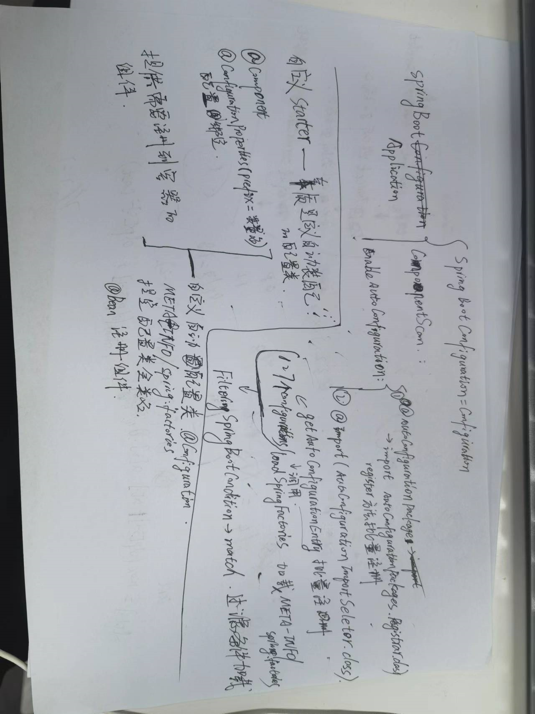

- - 

# Spring Boot自动装配



# Spring Boot启动流程

## 构造方法

```java
public SpringApplication(ResourceLoader resourceLoader, Class<?>... primarySources) {
   this.resourceLoader = resourceLoader;
   
   Assert.notNull(primarySources, "PrimarySources must not be null");
   
   this.primarySources = new LinkedHashSet<>(Arrays.asList(primarySources));
   
   // 获取应用类型，根据是否加载Servlet类判断是否是web环境
   this.webApplicationType = WebApplicationType.deduceFromClasspath();
   
   this.bootstrappers = new ArrayList<>(getSpringFactoriesInstances(Bootstrapper.class));
   
   // 读取META-INFO/spring.factories文件，获取对应的ApplicationContextInitializer装配到集合
   setInitializers((Collection) getSpringFactoriesInstances(ApplicationContextInitializer.class));
   
   // 设置所有监听器
   setListeners((Collection) getSpringFactoriesInstances(ApplicationListener.class));
   
   // 推断main函数
   this.mainApplicationClass = deduceMainApplicationClass();
}

```

可以看到构造方法里主要做了这么几件事：

1. 根据是否加载servlet类判断是否是web环境
2. 获取所有初始化器，扫描所有`META-INF/spring.factories`下的ApplicationContextInitializer子类通过反射拿到实例，在spring实例启动前后做一些回调工作。
3. 获取所有监听器，同2，也是扫描配置加载对应的类实例。
4. 定位main方法

## run方法

```java
/**
     * Run the Spring application, creating and refreshing a new
     * {@link ApplicationContext}.
     *
     * @param args the application arguments (usually passed from a Java main method)
     * @return a running {@link ApplicationContext}
     */
public ConfigurableApplicationContext run(String... args) {
    // 启动一个秒表计时器，用于统计项目启动时间
    StopWatch stopWatch = new StopWatch();
    stopWatch.start();
    // 创建启动上下文对象即spring根容器
    DefaultBootstrapContext bootstrapContext = createBootstrapContext();
    // 定义可配置的应用程序上下文变量
    ConfigurableApplicationContext context = null;
    /**
         * 设置jdk系统属性
         * headless直译就是无头模式，
         * headless模式的意思就是明确Springboot要在无鼠键支持的环境中运行，一般程序也都跑在Linux之类的服务器上，无鼠键支持，这里默认值是true；
         */
    configureHeadlessProperty();
    /**
         * 获取运行监听器 getRunListeners, 其中也是调用了上面说到的getSpringFactoriesInstances 方法
         * 从spring.factories中获取配置
         */
    SpringApplicationRunListeners listeners = getRunListeners(args);
    // 启动监听器
    listeners.starting(bootstrapContext, this.mainApplicationClass);
    try {
        // 包装默认应用程序参数，也就是在命令行下启动应用带的参数，如--server.port=9000
        ApplicationArguments applicationArguments = new DefaultApplicationArguments(args);
        //
        /**
             * 准备环境 prepareEnvironment 是个硬茬，里面主要涉及到
             * getOrCreateEnvironment、configureEnvironment、configurePropertySources、configureProfiles
             * environmentPrepared、bindToSpringApplication、attach诸多方法可以在下面的例子中查看
             */
        ConfigurableEnvironment environment = prepareEnvironment(listeners, bootstrapContext, applicationArguments);
        // 配置忽略的 bean
        configureIgnoreBeanInfo(environment);
        // 打印 SpringBoot 标志，即启动的时候在控制台的图案logo，可以在src/main/resources下放入名字是banner的自定义文件
        Banner printedBanner = printBanner(environment);
        // 创建 IOC 容器
        context = createApplicationContext();
        // 设置一个启动器，设置应用程序启动
        context.setApplicationStartup(this.applicationStartup);
        // 配置 IOC 容器的基本信息 (spring容器前置处理)
        prepareContext(bootstrapContext, context, environment, listeners, applicationArguments, printedBanner);
        /**
             * 刷新IOC容器
             * 这里会涉及Spring容器启动、自动装配、创建 WebServer启动Web服务即SpringBoot启动内嵌的 Tomcat
             */
        refreshContext(context);
        /**
             * 留给用户自定义容器刷新完成后的处理逻辑
             * 刷新容器后的扩展接口(spring容器后置处理)
             */
        afterRefresh(context, applicationArguments);
        // 结束计时器并打印，这就是我们启动后console的显示的时间
        stopWatch.stop();
        if (this.logStartupInfo) {
            // 打印启动完毕的那行日志
            new StartupInfoLogger(this.mainApplicationClass).logStarted(getApplicationLog(), stopWatch);
        }
        // 发布监听应用上下文启动完成（发出启动结束事件），所有的运行监听器调用 started() 方法
        listeners.started(context);
        // 执行runner，遍历所有的 runner，调用 run 方法
        callRunners(context, applicationArguments);
    } catch (Throwable ex) {
        // 异常处理，如果run过程发生异常
        handleRunFailure(context, ex, listeners);
        throw new IllegalStateException(ex);
    }

    try {
        // 所有的运行监听器调用 running() 方法,监听应用上下文
        listeners.running(context);
    } catch (Throwable ex) {
        // 异常处理
        handleRunFailure(context, ex, null);
        throw new IllegalStateException(ex);
    }
    // 返回最终构建的容器对象
    return context;
}

```

### refresh方法

这里就不在粘代码了，直接总结成几句话吧，代码多了记不住。refresh方法贯穿bean的生命周期

#### invokeBeanFactoryPostProcessors

1. invokeBeanFactoryPostProcessors方法会找出beanFactory中所有的实现了**BeanDefinitionRegistryPostProcessor**接口和**BeanFactoryPostProcessor**接口的bean并执行postProcessor中的postProcessBeanDefinitionRegistry()方法和postProcessBeanFactory()方法
2. 调用doProcessConfigurationClass方法会处理所有SpringBoot注解标注的所有类，如@Import、@Bean等注解。
3. **调用BeanDefinitionRegistryPostProcessor实现向容器内添加bean的定义, 调用BeanFactoryPostProcessor实现向容器内添加bean的定义添加属性。**(SpringBean的生命周期)

#### onRefresh

创建web容器。如果是web环境当中，会构建一个tomcat web容器。


