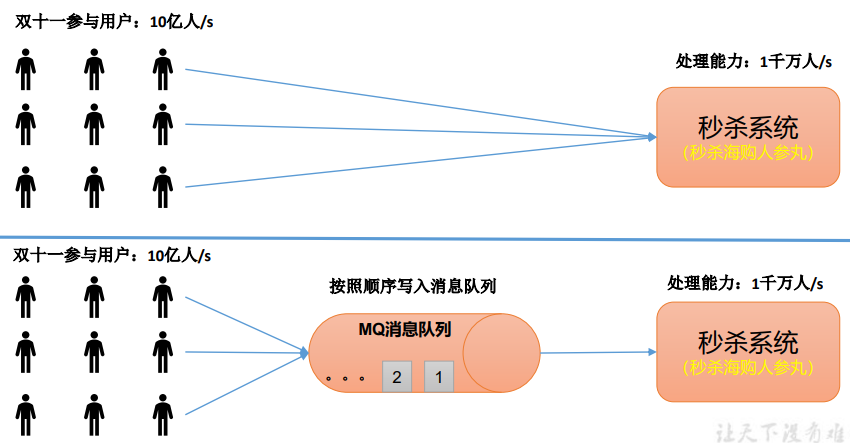
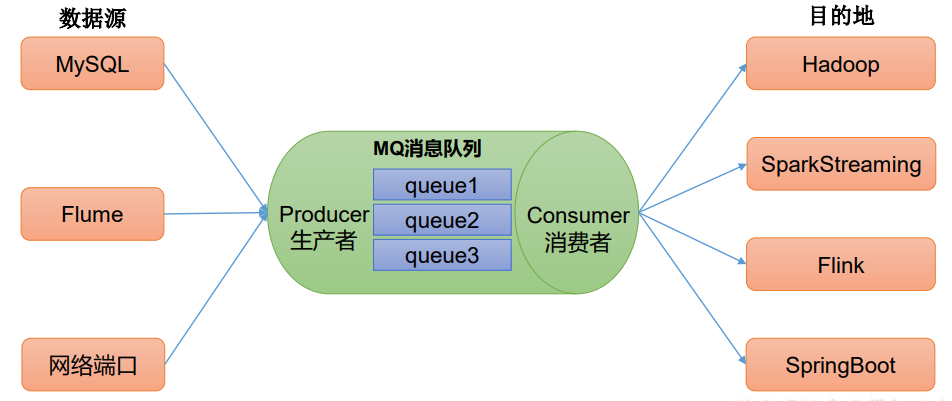
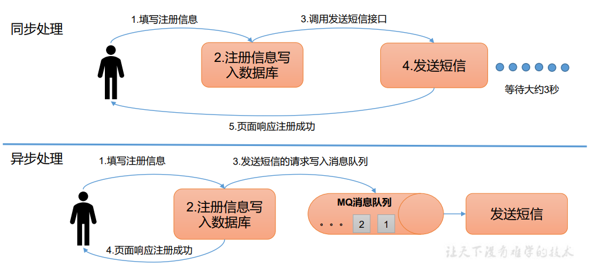
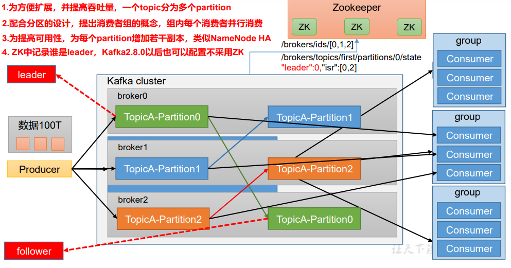
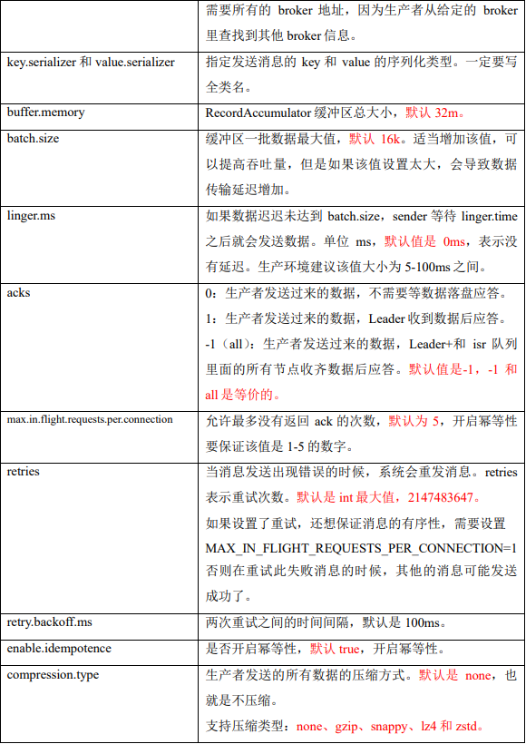
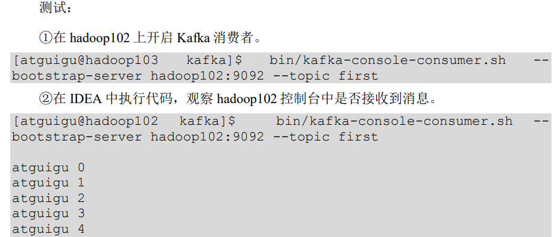
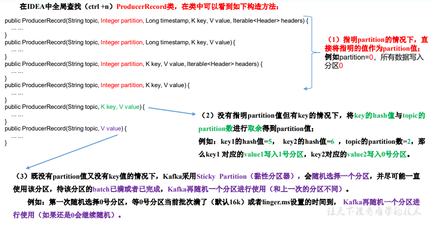
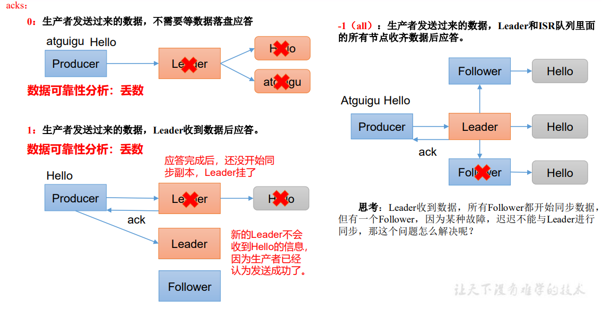

# 1. Kafka基础知识

## 1.1 定义

Kafka传统定义：Kafka是一个分布式的基于发布/订阅模式的消息队列（Message Queue），主要应用于大数据实时处理领域。 Kafka最新定义 ： Kafka是 一个开源的 分 布式事件流平台 （Event Streaming Platform），被数千家公司用于高性能数据管道、流分析、数据集成和关键任务应用。

## 1.2 消息队列

目 前企 业中比 较常 见的 消息 队列产 品主 要有 Kafka、ActiveMQ 、RabbitMQ 、 RocketMQ 等。 

在**大数据**场景主要采用 Kafka 作为消息队列。在 JavaEE 开发中主要采用 ActiveMQ、 RabbitMQ、RocketMQ。

### 1.2.1 传统消息队列的应用场景

传统的消息队列的主要应用场景包括：**缓存/消峰、解耦和异步通信**。

#### 1.2.1.1 缓冲/消峰

有助于控制和优化数据流经过系统的速度，解决生产消息和消费消息的处理速度不一致的情况。



#### 1.2.1.2 解耦

允许你独立的扩展或修改两边的处理过程，只要确保它们遵守同样的接口约束。



#### 1.2.1.3 异步通信

允许用户把一个消息放入队列，但并不立即处理它，然后在需要的时候再去处理它们。



### 1.2.2 消息队列的两种模式

#### 1.2.2.1 点对点模式

消费者主动拉取数据，消息收到后清除消息


#### 1.2.2.2 发布/订阅模式


## 1.3 Kafka基础架构



1. Producer：消息生产者，就是向 Kafka broker 发消息的客户端。 
2. Consumer：消息消费者，向 Kafka broker 取消息的客户端。 
3. Consumer Group（CG）：消费者组，由多个 consumer 组成。消费者组内每个消 费者负责消费不同分区的数据，一个分区只能由一个组内消费者消费；消费者组之间互不 影响。所有的消费者都属于某个消费者组，即消费者组是逻辑上的一个订阅者。 
4. Broker：一台 Kafka 服务器就是一个 broker。一个集群由多个 broker 组成。一个 broker 可以容纳多个 topic。 
5. Topic：可以理解为一个队列，生产者和消费者面向的都是一个 topic。 
6. Partition：为了实现扩展性，一个非常大的 topic 可以分布到多个 broker（即服 务器）上，一个 topic 可以分为多个 partition，每个 partition 是一个有序的队列。 
7. Replica：副本。一个 topic 的每个分区都有若干个副本，一个 Leader 和若干个 Follower。 
8. Leader：每个分区多个副本的“主”，生产者发送数据的对象，以及消费者消费数 据的对象都是 Leader。
9. Follower：每个分区多个副本中的“从”，实时从 Leader 中同步数据，保持和 Leader 数据的同步。Leader 发生故障时，某个 Follower 会成为新的 Leader。

# 2. Kafka安装与部署

# 3. Kafka生产者

## 3.1 生产者消息发送流程

### 3.1.1 发送原理

在消息发送的过程中，涉及到了两个线程——main 线程和 Sender 线程。在 main 线程 中创建了一个双端队列 RecordAccumulator。main 线程将消息发送给 RecordAccumulator， Sender 线程不断从 RecordAccumulator 中拉取消息发送到 Kafka Broker。


### 3.1.2 生产者重要参数列表




## 3.2 异步发送 API

### 3.2.1 普通异步发送

1. 需求：创建 Kafka 生产者，采用异步的方式发送到 Kafka Broker

2. 代码编写

   （1）创建工程 kafka 

   （2）导入依赖   org.apache.kafka kafka-clients 3.0.0  

   ```xml
   <dependencies>
        <dependency>
            <groupId>org.apache.kafka</groupId>
            <artifactId>kafka-clients</artifactId>
            <version>3.0.0</version>
        </dependency>
   </dependencies>
   ```

   （3）创建包名：com.atguigu.kafka.producer 

   （4）编写不带回调函数的 API 代码

   ```java
   import org.apache.kafka.clients.producer.KafkaProducer;
   import org.apache.kafka.clients.producer.ProducerRecord;
   import java.util.Properties;
   public class CustomProducer {
       public static void main(String[] args) throws InterruptedException {
           // 1. 创建 kafka 生产者的配置对象
           Properties properties = new Properties();
           // 2. 给 kafka 配置对象添加配置信息：bootstrap.servers
           properties.put(ProducerConfig.BOOTSTRAP_SERVERS_CONFIG, "hadoop102:9092");
           // key,value 序列化（必须）：key.serializer，value.serializer
           properties.put(ProducerConfig.KEY_SERIALIZER_CLASS_CONFIG, 
                          "org.apache.kafka.common.serialization.StringSerializer");
           properties.put(ProducerConfig.VALUE_SERIALIZER_CLASS_CONFIG, 
                          "org.apache.kafka.common.serialization.StringSerializer");
           // 3. 创建 kafka 生产者对象
           KafkaProducer<String, String> kafkaProducer = new KafkaProducer<String, String>(properties);
           // 4. 调用 send 方法,发送消息
           for (int i = 0; i < 5; i++) {
               kafkaProducer.send(new ProducerRecord<>("first","atguigu " + i));
           }
           // 5. 关闭资源
           kafkaProducer.close();
       }
   } 
   
   ```

   

### 3.2.2 带回调函数的异步发送

回调函数会在 producer 收到 ack 时调用，为异步调用，该方法有两个参数，分别是元 数据信息（RecordMetadata）和异常信息（Exception），如果 Exception 为 null，说明消息发 送成功，如果 Exception 不为 null，说明消息发送失败

**注意：消息发送失败会自动重试，不需要我们在回调函数中手动重试。**

```java
import org.apache.kafka.clients.producer.*;
import java.util.Properties;
public class CustomProducerCallback {
    public static void main(String[] args) throws 
        InterruptedException {
        // 1. 创建 kafka 生产者的配置对象
        Properties properties = new Properties();
        // 2. 给 kafka 配置对象添加配置信息
        properties.put(ProducerConfig.BOOTSTRAP_SERVERS_CONFIG, "hadoop102:9092");
        // key,value 序列化（必须）：key.serializer，value.serializer
        properties.put(ProducerConfig.KEY_SERIALIZER_CLASS_CONFIG, StringSerializer.class.getName());
        properties.put(ProducerConfig.VALUE_SERIALIZER_CLASS_CONFIG, StringSerializer.class.getName());
        // 3. 创建 kafka 生产者对象
        KafkaProducer<String, String> kafkaProducer = new KafkaProducer<String, String>(properties);
        // 4. 调用 send 方法,发送消息
        for (int i = 0; i < 5; i++) {
            // 添加回调
            kafkaProducer.send(new ProducerRecord<>("first", "atguigu " + i), new Callback() {
                // 该方法在 Producer 收到 ack 时调用，为异步调用
                @Override
                public void onCompletion(RecordMetadata metadata, Exception exception) {
                    if (exception == null) {
                        // 没有异常,输出信息到控制台
                        System.out.println(" 主题： "
                                           + metadata.topic() + "->" + "分区：" + metadata.partition());
                    } else {
                        exception.printStackTrace();// 出现异常打印
                    }
                }
            });
            Thread.sleep(2); // 延迟一会会看到数据发往不同分区
        }
        // 5. 关闭资源
        kafkaProducer.close();
    }
}

```


## 3.3 同步发送 API

只需在异步发送的基础上，再调用一下 get()方法即可。

```java
import org.apache.kafka.clients.producer.KafkaProducer;
import org.apache.kafka.clients.producer.ProducerRecord;
import java.util.Properties;
public class CustomProducer {
    public static void main(String[] args) throws InterruptedException {
        // 1. 创建 kafka 生产者的配置对象
        Properties properties = new Properties();
        // 2. 给 kafka 配置对象添加配置信息：bootstrap.servers
        properties.put(ProducerConfig.BOOTSTRAP_SERVERS_CONFIG, "hadoop102:9092");
        // key,value 序列化（必须）：key.serializer，value.serializer
        properties.put(ProducerConfig.KEY_SERIALIZER_CLASS_CONFIG, 
                       "org.apache.kafka.common.serialization.StringSerializer");
        properties.put(ProducerConfig.VALUE_SERIALIZER_CLASS_CONFIG, 
                       "org.apache.kafka.common.serialization.StringSerializer");
        // 3. 创建 kafka 生产者对象
        KafkaProducer<String, String> kafkaProducer = new KafkaProducer<String, String>(properties);
        // 4. 调用 send 方法,发送消息
        for (int i = 0; i < 5; i++) {
            kafkaProducer.send(new ProducerRecord<>("first","atguigu " + i)).get();
        }
        // 5. 关闭资源
        kafkaProducer.close();
    }
} 

```

## 3.4 生产者分区 

### 3.4.1 分区好处

（1）便于合理使用存储资源，每个Partition在一个Broker上存储，可以把海量的数据按照分区切割成一 块一块数据存储在多台Broker上。合理控制分区的任务，可以实现负载均衡的效果。 

（2）提高并行度，生产者可以以分区为单位发送数据；消费者可以以分区为单位进行消费数据。

### 3.4.2 生产者发送消息的分区策略

1）默认的分区器 DefaultPartitioner



### 3.4.3 自定义分区器

1. 需求 例如我们实现一个分区器实现，发送过来的数据中如果包含 atguigu，就发往 0 号分区， 不包含 atguigu，就发往 1 号分区。

2. 实现步骤 

   1. 定义类实现 Partitioner 接口。 
   2. 重写 partition()方法。

   ```java
   import org.apache.kafka.clients.producer.Partitioner;
   import org.apache.kafka.common.Cluster;
   import java.util.Map;
   /**
   * 1. 实现接口 Partitioner
   * 2. 实现 3 个方法:partition,close,configure
   * 3. 编写 partition 方法,返回分区号
   */
   public class MyPartitioner implements Partitioner {
       /**
   * 返回信息对应的分区
    * @param topic 主题
    * @param key 消息的 key
    * @param keyBytes 消息的 key 序列化后的字节数组
    * @param value 消息的 value
    * @param valueBytes 消息的 value 序列化后的字节数组
    * @param cluster 集群元数据可以查看分区信息
    * @return
    */
       @Override
       public int partition(String topic, Object key, byte[] 
                            keyBytes, Object value, byte[] valueBytes, Cluster cluster) {
           // 获取消息
           String msgValue = value.toString();
           // 创建 partition
           int partition;
           // 判断消息是否包含 atguigu
           if (msgValue.contains("atguigu")){
               partition = 0;
           }else {
               partition = 1;
           }
           // 返回分区号
           return partition;
       }
       // 关闭资源
       @Override
       public void close() {
       }
       // 配置方法
       @Override
       public void configure(Map<String, ?> configs) {
       }
   }
   
   ```

   （3）使用分区器的方法，在生产者的配置中添加分区器参数。

   ```java
   import org.apache.kafka.clients.producer.*;
   import java.util.Properties;
   public class CustomProducerCallbackPartitions {
       public static void main(String[] args) throws  InterruptedException {
           Properties properties = new Properties();
           properties.put(ProducerConfig.BOOTSTRAP_SERVERS_CONFIG,"hadoop102:9092");
           properties.put(ProducerConfig.KEY_SERIALIZER_CLASS_CONFIG, StringSerializer.class.getName());
           properties.put(ProducerConfig.VALUE_SERIALIZER_CLASS_CONFIG, StringSerializer.class.getName());
           // 添加自定义分区器
           properties.put(ProducerConfig.PARTITIONER_CLASS_CONFIG,
                          "com.atguigu.kafka.producer.MyPartitioner");
           KafkaProducer<String, String> kafkaProducer = new KafkaProducer<>(properties);
           for (int i = 0; i < 5; i++) {
               kafkaProducer.send(new ProducerRecord<>("first", "atguigu " + i), new Callback() {
                   @Override
                   public void onCompletion(RecordMetadata metadata, Exception e) {
                       if (e == null){
                           System.out.println(" 主题： " + 
                                                  metadata.topic() + "->" + "分区：" + metadata.partition()
                                                 );
                       }else {
                           e.printStackTrace();
                       }
                   }
               });
           }
           kafkaProducer.close();
       }
   }
   ```

## 3.5 生产经验 —— 生产者如何提高吞吐量

- batch.size：批次大小，默认16k  
- linger.ms：等待时间，修改为5-100ms 一次拉一个， 来了就走
- compression.type：压缩snappy 
- RecordAccumulator：缓冲区大小，修改为64m

```java
import org.apache.kafka.clients.producer.KafkaProducer;
import org.apache.kafka.clients.producer.ProducerRecord;
import java.util.Properties;
public class CustomProducerParameters {
    public static void main(String[] args) throws InterruptedException {
        // 1. 创建 kafka 生产者的配置对象
        Properties properties = new Properties();
        // 2. 给 kafka 配置对象添加配置信息：bootstrap.servers
        properties.put(ProducerConfig.BOOTSTRAP_SERVERS_CONFIG, "hadoop102:9092");
        // key,value 序列化（必须）：key.serializer，value.serializer
        properties.put(ProducerConfig.KEY_SERIALIZER_CLASS_CONFIG, 
                       "org.apache.kafka.common.serialization.StringSerializer");
        properties.put(ProducerConfig.VALUE_SERIALIZER_CLASS_CONFIG, 
                       "org.apache.kafka.common.serialization.StringSerializer");
        // batch.size：批次大小，默认 16K
        properties.put(ProducerConfig.BATCH_SIZE_CONFIG, 16384);
        // linger.ms：等待时间，默认 0
        properties.put(ProducerConfig.LINGER_MS_CONFIG, 1);
        // RecordAccumulator：缓冲区大小，默认 32M：buffer.memory
        properties.put(ProducerConfig.BUFFER_MEMORY_CONFIG, 33554432);
        // compression.type：压缩，默认 none，可配置值 gzip、snappy、 lz4 和 zstd
        properties.put(ProducerConfig.COMPRESSION_TYPE_CONFIG,"snappy");
        // 3. 创建 kafka 生产者对象
        KafkaProducer<String, String> kafkaProducer = new KafkaProducer<String, String>(properties);
        // 4. 调用 send 方法,发送消息
        for (int i = 0; i < 5; i++) {
            kafkaProducer.send(new ProducerRecord<>("first","atguigu " + i));
        }
        // 5. 关闭资源
        kafkaProducer.close();
    }
} 
```

## 3.6 生产经验——数据可靠性





可靠性总结：

- cks=0，生产者发送过来数据就不管了，可靠性差，效率高； 
- acks=1，生产者发送过来数据Leader应答，可靠性中等，效率中等； 
- acks=-1，生产者发送过来数据Leader和ISR队列里面所有Follwer应答，可靠性高，效率低；

 在生产环境中，acks=0很少使用；acks=1，一般用于传输普通日志，允许丢个别数据；acks=-1，一般用于传输和钱相关的数据， 对可靠性要求比较高的场景。


## 3.7 生产经验——数据去重

### 3.7.1 数据传递语义

- 至少一次（At Least Once）= ACK级别设置为-1 + 分区副本大于等于2 + ISR里应答的最小副本数量大于等于2
- 最多一次（At Most Once）= ACK级别设置为0
- 总结： At Least Once可以保证数据不丢失，但是不能保证数据不重复； At Most Once可以保证数据不重复，但是不能保证数据不丢失。 
- 精确一次（Exactly Once）：对于一些非常重要的信息，比如和钱相关的数据，要求数据既不能重复也不丢失。 Kafka 0.11版本以后，引入了一项重大特性：幂等性和事务。

# 面试题总结

## 1. Kafka 是什么

Kafka 是一个分布式消息队列系统，采用发布-订阅模式，支持多个生产者和消费者同时访问一个或多个主题(topic)，并提供了多种消息存储和传输方式，包括磁盘存储、内存存储和零拷贝技术等。

Kafka 的核心架构由若干个独立的节点组成，其中包括多个 Broker、多个 ZooKeeper 节点和多个生产者和消费者。Kafka 的数据存储采用分区机制，每个主题(topic)可以被分成多个分区(partition)，每个分区存储在多个 Broker 上，以提高数据可靠性和并发处理能力。

>ZooKeeper 在 Kafka 中起到以下几个作用：
>
>1. 维护集群元数据：Kafka 集群中的 Broker、Topic、Partition 等元数据信息都是存储在 ZooKeeper 中，ZooKeeper 提供了对这些元数据的统一管理和维护。
>2. 负责领导者选举：Kafka 集群中的每个 Partition 都会有一个 Leader 和多个 Follower，ZooKeeper 会协助进行领导者选举，确保每个 Partition 都有 Leader 以及 Follower 的同步数据。
>3. 监听 Broker 上下线：Kafka 集群中的 Broker 可能会因为各种原因宕机或者上线，ZooKeeper 会监测这些状态变化，并及时更新 Broker 的信息。
>4. 保存消费者 Offset：Kafka 消费者消费消息时，需要记录当前消费的位置，ZooKeeper 提供了一个稳定的存储方式来保存消费者 Offset，确保在消费者宕机后能够恢复消费状态。
>5. 管理 ACLs：ZooKeeper 提供了访问控制列表（ACLs）的功能，Kafka 通过 ZooKeeper 管理 ACLs，可以进行身份认证和权限管理，确保数据安全。
>
>总的来说，ZooKeeper 在 Kafka 中扮演着重要的角色，通过管理和维护集群元数据、领导者选举、Broker 上下线、消费者 Offset 保存以及权限管理等功能，保证了 Kafka 集群的可靠性、可扩展性和高性能。

## 2. partition 的数据文件（offset， MessageSize， data）

partition 中的每条 Message 包含了以下三个属性： offset， MessageSize， data， 其中 offset 表示 Message 在这个 partition 中的偏移量， offset 不是该 Message 在 partition 数据文件中的实际存储位置，而是逻辑上一个值，它唯一确定了 partition 中的一条 Message，可以认为 offset 是partition 中 Message 的 id； MessageSize 表示消息 内容 data 的大小； data 为 Message 的具体内容。

## 3. 和其他消息队列相比,Kafka的优势在哪里？

1. 高吞吐量：Kafka 能够处理数以千计的消息并发读写，具有很高的吞吐量。
2. 高可靠性：Kafka 采用分布式架构，每个节点都有备份机制，一旦某个节点宕机，数据不会丢失。
3. 高扩展性：Kafka 可以通过水平扩展（增加节点）来增加吞吐量和存储能力，支持横向扩展和纵向扩展。
4. 高灵活性：Kafka 可以根据不同的需求进行配置，支持多种数据格式和编解码方式。
5. 实时处理能力：Kafka 具有实时数据处理能力，可以处理实时数据和流数据，支持多种处理方式和工具。
6. 高性能和低延迟：Kafka 使用零拷贝技术和批量读写等优化手段，能够实现低延迟和高性能的数据处理。

## 4. 队列模型了解吗？Kafka 的消息模型知道吗？

### 队列模型：早期的消息模型


**使用队列（Queue）作为消息通信载体，满足生产者与消费者模式，一条消息只能被一个消费者使用，未被消费的消息在队列中保留直到被消费或超时。**

比如：我们生产者发送 100 条消息的话，两个消费者来消费一般情况下两个消费者会按照消息发送的顺序各自消费一半（也就是你一个我一个的消费。）

**队列模型存在的问题：**

假如我们存在这样一种情况：我们需要将生产者产生的消息分发给多个消费者，并且每个消费者都能接收到完整的消息内容。

### 发布-订阅模型:Kafka 消息模型

发布-订阅模型主要是为了解决队列模型存在的问题


**在发布 - 订阅模型中，如果只有一个订阅者，那它和队列模型就基本是一样的了。所以说，发布 - 订阅模型在功能层面上是可以兼容队列模型的。**

**Kafka 采用的就是发布 - 订阅模型。**

> **RocketMQ 的消息模型和 Kafka 基本是完全一样的。唯一的区别是 Kafka 中没有队列这个概念，与之对应的是 Partition（分区）。**

## 5. 什么是Producer、Consumer、Broker、Topic、Partition？


上面这张图也为我们引出了，Kafka 比较重要的几个概念：

1. **Producer（生产者）** : 产生消息的一方。
2. **Consumer（消费者）** : 消费消息的一方。
3. **Broker（代理）** : 可以看作是一个独立的 Kafka 实例。多个 Kafka Broker 组成一个 Kafka Cluster。

同时，你一定也注意到每个 Broker 中又包含了 Topic 以及 Partition 这两个重要的概念：

- **Topic（主题）** : Producer 将消息发送到特定的主题，Consumer 通过订阅特定的 Topic(主题) 来消费消息。
- **Partition（分区）** : Partition 属于 Topic 的一部分。一个 Topic 可以有多个 Partition ，并且同一 Topic 下的 Partition 可以分布在不同的 Broker 上，这也就表明一个 Topic 可以横跨多个 Broker 。这正如我上面所画的图一样。

> 划重点：**Kafka 中的 Partition（分区） 实际上可以对应成为消息队列中的队列。这样是不是更好理解一点？**

## 6. Kafka 的多副本机制了解吗？带来了什么好处？

Kafka 将每个 Partition 的数据分为多个副本，其中一个为 Leader 副本，其余为 Follower 副本。Leader 副本负责处理读写请求，Follower 副本则负责同步 Leader 副本的数据。当 Leader 副本宕机或出现故障时，Follower 副本可以接替成为新的 Leader 副本，确保数据的持久性和可靠性。

>副本之间的数据复制是通过 Leader-Follower 机制来实现的。具体来说，当 Producer 将消息发送到 Kafka 的一个 Partition 上时，Leader 副本会负责接收和处理该消息，并将其写入本地的日志文件中。随后，Leader 副本会将该消息发送给所有 Follower 副本，Follower 副本接收到消息后将其写入本地的日志文件中，并向 Leader 副本发送确认消息。
>
>Kafka 使用异步复制机制，即 Leader 副本不会等待所有 Follower 副本的确认消息，而是将消息直接发送给 Follower 副本并等待 Follower 副本的确认。如果 Follower 副本在一定时间内未能确认，则会进行重试，直到数据被所有 Follower 副本确认为止。当 Leader 副本收到大多数 Follower 副本的确认消息后，即可认为消息已经被成功复制到所有副本中。

**好处**

1. Kafka 通过给特定 Topic 指定多个 Partition, 而各个 Partition 可以分布在不同的 Broker 上, 这样便能提供比较好的并发能力（负载均衡）。
2. Partition 可以指定对应的 Replica 数, 这也极大地提高了消息存储的安全性, 提高了容灾能力，不过也相应的增加了所需要的存储空间

## 7. Zookeeper 在 Kafka 中的作用知道吗？

1. 维护集群元数据：Kafka 集群中的 Broker、Topic、Partition 等元数据信息都是存储在 ZooKeeper 中，ZooKeeper 提供了对这些元数据的统一管理和维护。
2. 负责领导者选举：Kafka 集群中的每个 Partition 都会有一个 Leader 和多个 Follower，ZooKeeper 会协助进行领导者选举，确保每个 Partition 都有 Leader 以及 Follower 的同步数据。
3. 监听 Broker 上下线：Kafka 集群中的 Broker 可能会因为各种原因宕机或者上线，ZooKeeper 会监测这些状态变化，并及时更新 Broker 的信息。
4. 保存消费者 Offset：Kafka 消费者消费消息时，需要记录当前消费的位置，ZooKeeper 提供了一个稳定的存储方式来保存消费者 Offset，确保在消费者宕机后能够恢复消费状态。
5. **负载均衡** ：上面也说过了 Kafka 通过给特定 Topic 指定多个 Partition, 而各个 Partition 可以分布在不同的 Broker 上, 这样便能提供比较好的并发能力。 对于同一个 Topic 的不同 Partition，Kafka 会尽力将这些 Partition 分布到不同的 Broker 服务器上。当生产者产生消息后也会尽量投递到不同 Broker 的 Partition 里面。当 Consumer 消费的时候，Zookeeper 可以根据当前的 Partition 数量以及 Consumer 数量来实现动态负载均衡。

## 8. Kafka 如何保证消息的消费顺序？

我们在使用消息队列的过程中经常有业务场景需要严格保证消息的消费顺序，比如我们同时发了 2 个消息，这 2 个消息对应的操作分别对应的数据库操作是：

1. 更改用户会员等级。
2. 根据会员等级计算订单价格。

假如这两条消息的消费顺序不一样造成的最终结果就会截然不同。

我们知道 Kafka 中 Partition(分区)是真正保存消息的地方，我们发送的消息都被放在了这里。而我们的 Partition(分区) 又存在于 Topic(主题) 这个概念中，并且我们可以给特定 Topic 指定多个 Partition。


每次添加消息到 Partition(分区) 的时候都会采用尾加法，如上图所示。 **Kafka 只能为我们保证 Partition(分区) 中的消息有序。**

> 消息在被追加到 Partition(分区)的时候都会分配一个特定的偏移量（offset）。Kafka 通过偏移量（offset）来保证消息在分区内的顺序性。

所以，我们就有一种很简单的保证消息消费顺序的方法：**1 个 Topic 只对应一个 Partition**。这样当然可以解决问题，但是破坏了 Kafka 的设计初衷。

Kafka 中发送 1 条消息的时候，可以指定 topic, partition, key,data（数据） 4 个参数。如果你发送消息的时候指定了 Partition 的话，所有消息都会被发送到指定的 Partition。并且，同一个 key 的消息可以保证只发送到同一个 partition，这个我们可以采用表/对象的 id 来作为 key 。

总结一下，对于如何保证 Kafka 中消息消费的顺序，有了下面两种方法：

1. 1 个 Topic 只对应一个 Partition。
2. （推荐）发送消息的时候指定 key/Partition。

当然不仅仅只有上面两种方法，上面两种方法是我觉得比较好理解的，

## 9. Kafka 如何保证消息不丢失

### 9.1 生产者丢失消息的情况

生产者(Producer) 调用`send`方法发送消息之后，消息可能因为网络问题并没有发送过去。

所以，我们不能默认在调用`send`方法发送消息之后消息发送成功了。为了确定消息是发送成功，我们要判断消息发送的结果。但是要注意的是 Kafka 生产者(Producer) 使用 `send` 方法发送消息实际上是异步的操作，我们可以通过 `get()`方法获取调用结果，但是这样也让它变为了同步操作，示例代码如下：

```java
SendResult<String, Object> sendResult = kafkaTemplate.send(topic, o).get();
if (sendResult.getRecordMetadata() != null) {
  logger.info("生产者成功发送消息到" + sendResult.getProducerRecord().topic() + "-> " + sendRe
              sult.getProducerRecord().value().toString());
}
```

但是一般不推荐这么做！可以采用为其添加回调函数的形式，示例代码如下：

```java
ListenableFuture<SendResult<String, Object>> future = kafkaTemplate.send(topic, o);
future.addCallback(result -> logger.info("生产者成功发送消息到topic:{} partition:{}的消息", 
                                         result.getRecordMetadata().topic(), 
                                         result.getRecordMetadata().partition()),
                                      ex -> logger.error("生产者发送消失败，原因：{}", ex.getMessage()));
```

如果消息发送失败的话，我们检查失败的原因之后重新发送即可！

另外这里推荐为 Producer 的`retries `（重试次数）设置一个比较合理的值，一般是 3 ，但是为了保证消息不丢失的话一般会设置比较大一点。设置完成之后，当出现网络问题之后能够自动重试消息发送，避免消息丢失。另外，建议还要设置重试间隔，因为间隔太小的话重试的效果就不明显了，网络波动一次你3次一下子就重试完了

### 9.2 消费者丢失消息的情况

我们知道消息在被追加到 Partition(分区)的时候都会分配一个特定的偏移量（offset）。偏移量（offset)表示 Consumer 当前消费到的 Partition(分区)的所在的位置。Kafka 通过偏移量（offset）可以保证消息在分区内的顺序性。


当消费者拉取到了分区的某个消息之后，消费者会自动提交了 offset。自动提交的话会有一个问题，试想一下，当消费者刚拿到这个消息准备进行真正消费的时候，突然挂掉了，消息实际上并没有被消费，但是 offset 却被自动提交了。

**解决办法也比较粗暴，我们手动关闭自动提交 offset，每次在真正消费完消息之后再自己手动提交 offset 。** 但是，细心的朋友一定会发现，这样会带来消息被重新消费的问题。比如你刚刚消费完消息之后，还没提交 offset，结果自己挂掉了，那么这个消息理论上就会被消费两次。

### 9.3 Kafka 弄丢了消息

试想一种情况：假如 leader 副本所在的 broker 突然挂掉，那么就要从 follower 副本重新选出一个 leader ，但是 leader 的数据还有一些没有被 follower 副本的同步的话，就会造成消息丢失。

**设置 acks = all**

解决办法就是我们设置 **acks = all**。acks 是 Kafka 生产者(Producer) 很重要的一个参数。

acks 的默认值即为1，代表我们的消息被leader副本接收之后就算被成功发送。当我们配置 **acks = all** 表示只有所有 ISR 列表的副本全部收到消息时，生产者才会接收到来自服务器的响应. 这种模式是最高级别的，也是最安全的，可以确保不止一个 Broker 接收到了消息. 该模式的延迟会很高。

> ISR（In-Sync Replicas）指的是与主副本保持同步的副本列表，也就是与主副本保持一致的副本集合。ISR 列表的大小可以通过参数 `min.insync.replicas` 来配置，该参数指定了至少有多少个副本必须与主副本保持同步，才能视为写入操作完成。

**设置 replication.factor >= 3**

为了保证 leader 副本能有 follower 副本能同步消息，我们一般会为 topic 设置 **replication.factor >= 3**。这样就可以保证每个 分区(partition) 至少有 3 个副本。虽然造成了数据冗余，但是带来了数据的安全性。

**设置 min.insync.replicas > 1**

一般情况下我们还需要设置 **min.insync.replicas> 1** ，这样配置代表消息至少要被写入到 2 个副本才算是被成功发送。**min.insync.replicas** 的默认值为 1 ，在实际生产中应尽量避免默认值 1。

## 10. Kafka 如何保证消息不重复消费

**kafka出现消息重复消费的原因：**

- 服务端侧已经消费的数据没有成功提交 offset（**根本原因**）。

- Kafka 侧 由于服务端处理业务时间长或者网络链接等等原因让 Kafka 认为服务假死，触发了分区 rebalance。

  > 在分区 rebalance 过程中，Kafka 会重新分配分区的负载，将分区从一个消费者转移给另一个消费者，以实现负载均衡。

**解决方案：**

- 消费消息服务做幂等校验，比如 Redis 的set、MySQL 的主键等天然的幂等功能。这种方法最有效。

  >**幂等校验**：无论消息被发送多少次，最终效果都只会产生一次。在 Kafka 中，幂等性是通过以下两个机制来实现的：
  >
  >1. 序列号：生产者在发送消息时，会给每条消息分配一个唯一的序列号。Kafka 会将序列号作为消息的主键，在接收到重复序列号的消息时会自动将其过滤掉，从而保证消息的幂等性。
  >2. 事务：Kafka 支持事务机制，可以将多个消息放在一个事务中一起发送，从而保证这些消息的原子性和幂等性。如果事务提交失败，则所有消息都会被回滚，保证消息发送的一致性。
  >
  >**幂等消费机制需要消费者手动开启，开启后，Kafka 会将每条消息的 offset 与一个幂等序列号关联，消费者只有在获得新的幂等序列号后才会进行消费，这样可以保证消息只被消费一次，从而避免消息重复消费的问题。**

- 将 `enable.auto.commit` 参数设置为 false，关闭自动提交，开发者在代码中手动提交 offset。那么这里会有个问题：

  什么时候提交offset合适？

  - 处理完消息再提交：依旧有消息重复消费的风险，和自动提交一样
  - 拉取到消息即提交：会有消息丢失的风险。允许消息延时的场景，一般会采用这种方式。然后，通过定时任务在业务不繁忙（比如凌晨）的时候做数据兜底。

## 11. 负载均衡

由于消息 topic 由多个 partition 组成， 且 partition 会均衡分布到不同 broker 上，因此，为了有效利用 broker 集群的性能，提高消息的吞吐量， producer 可以通过随机或者 hash 等方式，将消息平均发送到多个 partition 上，以实现负载均衡。