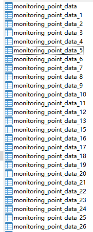

# 测试一张表1200w数据查询速度

根据测点id查询一张表中（7天的数据）所有数据的时间大概是10秒

# 设计分表方案

  * 按照5000个测点/分钟，每5分钟抽一次，一天的数据量为12 * 24 * 5000=144w，一周的数据量144 * 7 = 1008w
  * 按照每张表一千万左右的数据量存储，每张表可以存储存7天的数据
  * 系统中需要保留6个月的数据，每个月按照30天计算，一共是30 * 6 = 180天，分表需要180 ÷ 7 =26张

# 方案实施

在205测试环境中搭建分表中间件服务器mycat，使用mycat1.6.7。

* 在数据物理数据库中建27张表，每张表的结构一样（monitoring_point_data、monitoring_point_data_$1-26）

  

* 配置mycat分片规则和算法(rule.xml)

  规则为sharding-by-date，算法为partbyday

  起止时间为2022-01-01 ~ 2022-06-30，计算方式为与开始时间差的天数模7即为分片数据库编号，超出的部分减n模7，n为起止时间之间的天数。

  ```xml
  <!-- 规则 -->
  <tableRule name="sharding-by-date">
      <rule>
          <columns>collection_time</columns>
          <algorithm>partbyday</algorithm>
      </rule>
  </tableRule>
  <!-- 算法 -->
  <function name="partbyday"
  		  class="io.mycat.route.function.PartitionByDate">
  	<property name="dateFormat">yyyy-MM-dd</property>
  	<property name="sNaturalDay">0</property>
  	<property name="sBeginDate">2022-01-01</property>
  	<property name="sEndDate">2022-06-30</property>
  	<property name="sPartionDay">7</property>
  </function>
  ```

* 配置逻辑库(schema.xml)

  ```xml
  <schema name="jeecg_coldrolling" checkSQLschema="true" sqlMaxLimit="100" randomDataNode="dn1">
  	<table name="monitoring_point_data" primaryKey="ID" dataNode="dn1" subTables="monitoring_point_data_$1-26" rule="sharding-by-date"/>
  </schema>
  
  <dataNode name="dn1" dataHost="localhost1" database="point_data_db" />
  
  <dataHost name="localhost1" maxCon="1000" minCon="10" balance="1" balanceType="1"
  		  writeType="0" dbType="mysql" dbDriver="jdbc" switchType="1"  slaveThreshold="100">
  	<heartbeat>select user()</heartbeat>
  	<writeHost host="hostM1" url="jdbc:mysql://10.162.33.205:3306" user="root"
  			   password="ontoweb">
  		<readHost host="hostM1" url="jdbc:mysql://10.162.33.205:3306" password="ontoweb" user="root" weight="1"></readHost>
  	</writeHost>
  </dataHost>
  ```
  * schema 标签
    
* name 逻辑数据库名，mycat中的虚拟数据库，
    
     * table标签
       * name逻辑表名，物理数据库中必须存在这张表，否则mycat无法映射到物理数据库。
       * primaryKey：表的主键
       * dataNode：物理数据库节点名称，**==必须和dataNode中的name一致==**
       * subTables分表，物理数据库中必须有这些表，而且表的范围必须包含x %7，x为起止时间范围内任意天数
    * rule：分片算法，这里我自然日分片
  
  * dataNode标签
  
       * name：物理数据库数据节点名称
       * dataHost：物理数据库服务器主机名称，该名称==**必须与dataHost标签中的name一致**==，否则，使用mycat中无法创建与物理数据库相对应的逻辑库与逻辑表
    * database：物理数据库名称
  
  * dataHost标签
  
    物理主机上数据库服务器相关配置
  
* 配置mycat服务（server.xml）
  
     ```xml
     <user name="mycat" defaultAccount="true">
     	<property name="password">bwzw</property>
     	<property name="schemas">jeecg_coldrolling</property>
     	<property name="defaultSchema">jeecg_coldrolling</property>
     </user>
     ```
  这里只配置了用户信息，mycat默认端口为8066，在propertiy属性中可以修改
  
     ```xml
     <property name="serverPort">8066</property>
     ```
  
     * name：登录mycat时的用户名
     * property-password：登录mycat时的密码
     * property-schemas：使用mycat账户登录时创建的逻辑数据库逻辑数据库，==**库名必须与server.xml中schema标签下的name属性一致**==
     * property-defaultSchemas：目前没有测试过该配置项的作用。

# 测试切分表的读取和写入

√

# 测试非切分表的读取和写入

遇到了问题：通过mycat读取数据的时候报错，can't find table define in schema MONITORING_POINT_INFORMATION alias：monitoring_point_information, schema:jeecg_coldrolling，如果在schemas.xml的schema标签下配置table，就不会报这个错。但是如果每张表都要配置一个table标签，这种做法显然不够灵活，如果新增一张表就需要添加配置，然后重启mycat。有没有简单的配置？

# 测试趋势图数据读取

1. 根据测点读取一天的数据、两天的数据、三天的数据、甚至更长时间的数据
2. 看板后端程序通过mycat连接测试页面是否能正常显示，显示速度如何


