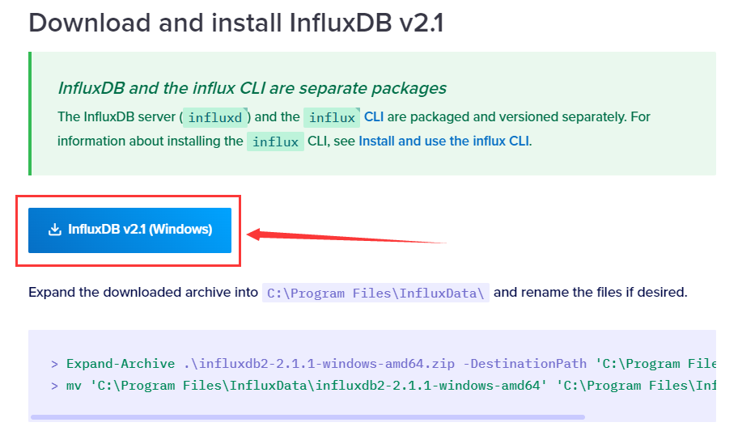
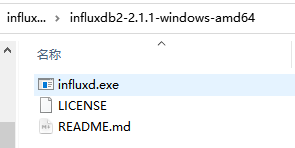
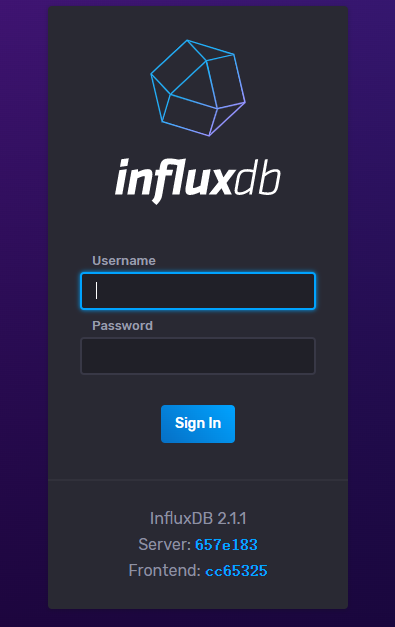
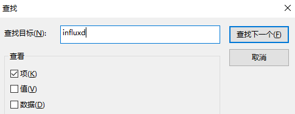
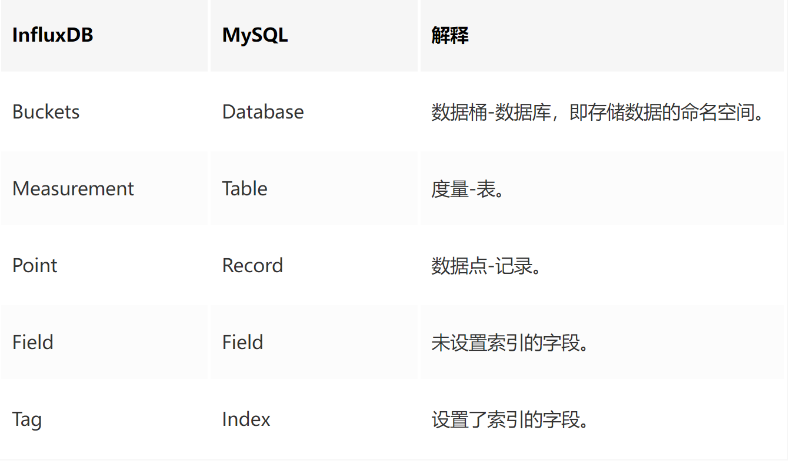
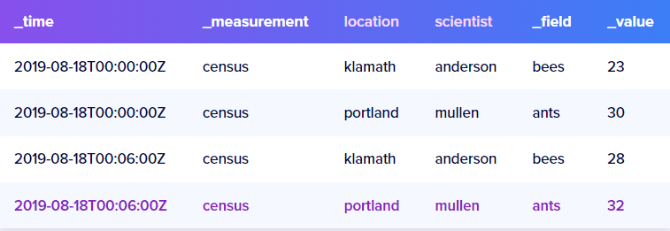

1. 文档：

   

2. 数据量支持：

3. 并发问题：


官方文档 https://docs.influxdata.com/influxdb/v2.1/ 

# 1. 安装

官方文档：https://docs.influxdata.com/influxdb/v2.1/install/?t=Windows

中文文档：https://jasper-zhang1.gitbooks.io/influxdb/content/Concepts/key_concepts.html?q=



下载完后解压即可


# 2. 启动

进入解压后的目录，打开cmd运行influxd




在浏览器地址栏中输入 http://127.0.0.1:8086，进入可视化客户端，首次进入需要注册登录（username，password，bucket，organization在读写数据时会用到）



# 3. 修改存储路径

|               默认存储路径                | 解释                                                         |
| :---------------------------------------: | ------------------------------------------------------------ |
|     C:\Users\tiger\.influxdbv2\engine     | InfluxDB 将所有时间结构合并树 (TSM) 数据存储在磁盘上的持久存储引擎文件的路径。 |
|  C:\Users\tiger\.influxdbv2\influxd.bolt  | BoltDB 数据库的路径。 BoltDB 是用 Go 编写的键值存储。 InfluxDB 使用 BoltDB 存储数据，包括组织和用户信息、UI 数据、REST 资源和其他关键值数据。 |
| C:\Users\tiger\.influxdbv2\influxd.sqlite | SQLite 数据库文件的路径。 SQLite 数据库用于存储notebooks和annotations的元数据 |

我们要修改这三个默认路径，因为数据量增大会占用大量C盘空间。

在influxd.exe同级目录下新建config.yml文件，添加如下内容：

```yml
engine-path: D:\\influxdb2-2.1.1\\engine
bolt-path: D:\\influxdb2-2.1.1\\influxd.bolt
sqlite-path: D:\\influxdb2-2.1.1\\influxd.sqlite
```

重新启动influxdb，启动成功后的安装目录结构如下：


# 4. 将influxd.exe注册为windows服务

[instsrv](./instsry.exe) + [srvany](./srvany.exe)

1. 将instsrv.exe和srvany.exe拷贝到`C:\Windows\SysWOW64`目录下

2. 在cmd中输入命令：

   ```bash
   instsrv influxd C:\Windows\SysWOW64\srvany.exe # influxd是服务名，可自定义
   ```

   

3. 打开注册表：（cmd中输入：`regedit`）

4. ctrl+F，搜索`influxd`（之前自定义的服务名称）

   

5. 右击`influxd`新建项，名称为`Parameters`

6. 之后在Parameters中新建几个`字符串值`


- 名称 Application 值：你要作为服务运行的程序地址。
- 名称 AppDirectory 值：你要作为服务运行的程序所在文件夹路径。
- 名称 AppParameters 值：你要作为服务运行的程序启动所需要的参数。

**之后启动服务`influxd`即可后台运行exe！**

# 5.相关概念介绍



<font size='5' color='red'>示例数据</font>

bucket：my_bucket




## 5.1 Organization

`organization` 是一组用户的工作空间，一个组下用户可以创建多个bucket

## 5.2 bucket

所有的 influxdb数据都存储在bucket中，`bucket`结合了数据库和保存期限（每条数据会被保留的时间）的概念，类似于RDMS的database的概念。`bucket`属于一个`organization`

## 5.3 Measurement 和 Point

`measurement`是所有 tags fields 和时间的容器，和RDMS的table的概念类似，是一个数据集的容器

point：

```bash
2019-08-18T00:00:00Z census ants 30 portland mullen
```

## 5.4 Fields

字段包括存储在列中的字段键和存储在`_field`列中的字段值`_value`。[Measurement](https://docs.influxdata.com/influxdb/v2.1/reference/key-concepts/data-elements/#measurement)至少需要一个字段。

### 5.4.1 Field key

Field key是表示字段名称的字符串。在上面的示例数据中，`bees`和`ants`是Field key。

### 5.4.2 Field value

字段值表示关联字段的值。字段值可以是字符串、浮点数、整数或布尔值。示例数据中的字段值显示`bees`指定时间的数量：`23`和，`28`以及指定时间的数量`ants`：`30`和`32`。

## 5.5 Field set

段集是与时间戳关联的字段键值对的集合。测量至少需要一个字段。样本数据包括以下字段集：

```bash
census bees=23i,ants=30i 1566086400000000000
census bees=28i,ants=32i 1566086760000000000
       -----------------
           Field set
```

<font size='5' color='red'>注意：</font>不要使用field作为查询条件

字段field是InfluxDB数据结构所必需的一部分， **在InfluxDB中不能没有field**。需要注意的是，field是没有索引的。如果使用field value作为过滤条件来查询，这样的查询非常慢，请不要使用field value作为查询条件。

## 5.6 Tags

和Fields类似，Tags也有 key value。但与Fields不同的是，field key存储在`_field`列中 而tag key则是本省就是列

### 5.6.1 tag key 

样本数据中的tag key 是`location`和`scientist`

### 5.6.2 tag value

tag key `location`有两个tag value：`klamath`和`portland`。tag key `scientist` 也有两个tab value：`anderson`和`mullen`。

### 5.6.3 Tag set

```bash
location = klamath, scientist = anderson
location = portland, scientist = anderson
location = klamath, scientist = mullen
location = portland, scientist = mullen
```

## 5.7 timestamp

所有存储在influxdb中的数据都有一个`_time`列用来记录时间，在磁盘中以纳秒之间戳存储，但客户端查询时返回的是格式化的更易读的 [RFC3339](https://links.jianshu.com/go?to=https%3A%2F%2Fdocs.influxdata.com%2Finfluxdb%2Fv2.1%2Freference%2Fglossary%2F%23rfc3339-timestamp) UTC时间格式


# 6. 语法介绍

## 6.1 写数据

```java
public class PublicVals {
    public static final String URL = "http://10.162.32.200:8086";
    public static final char[] TOKEN = "i1KThOhc1dtDP9swQc8kEUmB2n891HbASuu-gZMU2OKdyG9b7CaczW_rJ_Lj2Reuz4qTjTtWCuBAJMab9urV3A==".toCharArray();
    public static final String ORGANIZATION = "wust";
    public static final String BUCKET = "wust";
}
```

### 6.1.1 Write By Data Point

```java
public static void main(final String[] args) {

    InfluxDBClient influxDBClient = InfluxDBClientFactory.create(PublicVals.URL, PublicVals.TOKEN, PublicVals.ORGANIZATION, PublicVals.BUCKET);
    
    WriteApiBlocking writeApi = influxDBClient.getWriteApiBlocking();
    
    Point point = Point.measurement("temperature")
            .addTag("location", "west")
            .addField("value", 55D)
            .addField("tagName", "test")
            .time(Instant.now().toEpochMilli(), WritePrecision.MS);

    writeApi.writePoint(point);

    influxDBClient.close();
}
```

### 6.1.2 Write By POJO


### 6.1.3 Write By LineProtocol


## 6.2 查数据

### 6.2.1 Flux 的查询语法

```js
from(bucket: "example-bucket")
    |> range(start: -15m)
    |> filter(fn: (r) => r._measurement == "cpu" and r._field == "usage_system" and r.cpu == "cpu-total")
```

- `from()`函数定义了一个 InfluxDB 数据源。它需要一个`bucket`参数。

- `range()`函数接受两个参数：`start`和`stop`。开始和停止值可以是使用负[持续时间的](https://docs.influxdata.com/flux/v0.x/data-types/basic/duration/)**相对**值 或使用[时间戳的](https://docs.influxdata.com/flux/v0.x/data-types/basic/time/)**绝对值**。

  ```js
  |> range(start: 2021-01-01T00:00:00Z, stop: 2021-01-01T12:00:00Z)
  ```

- `filter()`基于数据属性或列缩小结果范围，filter()函数有一个参数fn，fn需要一个匿名函数，该函数具有基于列或属性过滤数据的逻辑。`filter()`遍历每个输入行并将行数据构造为 Flux 记录传递到匿名函数中(r)，通过匿名函数判断该行数据是否需要保留。
