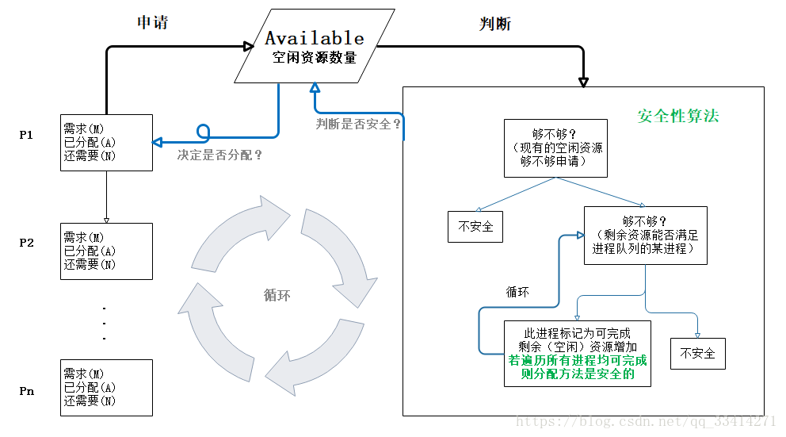
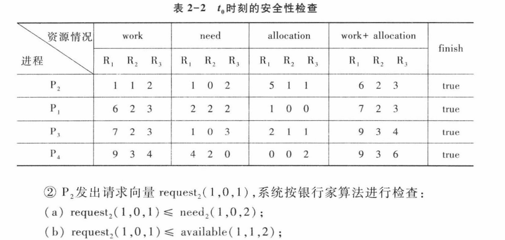
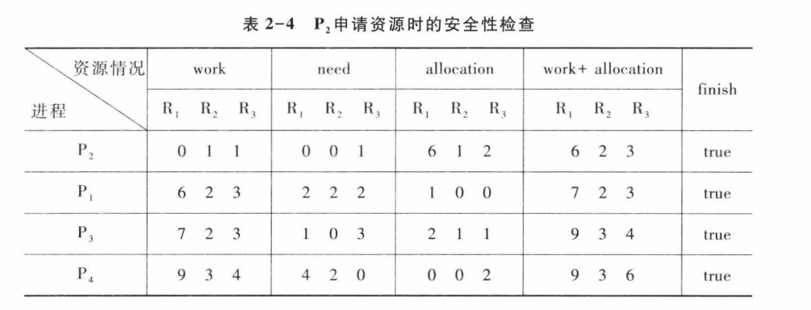
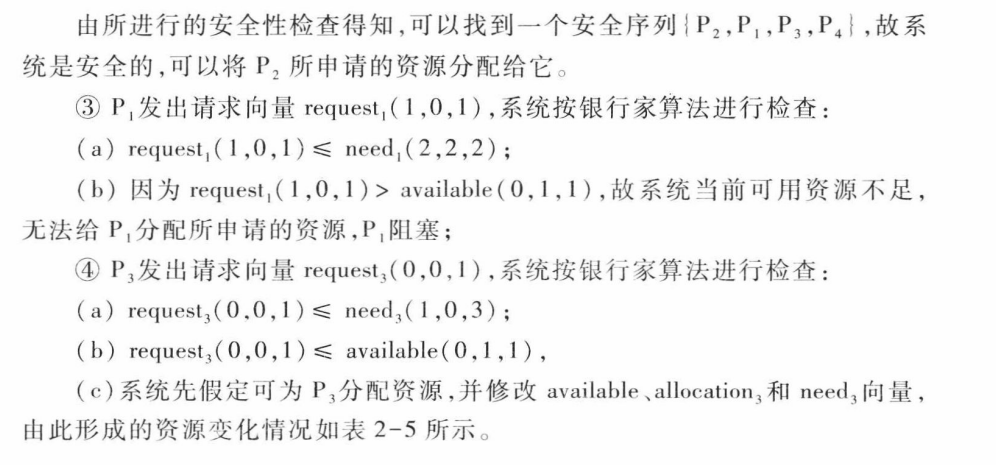
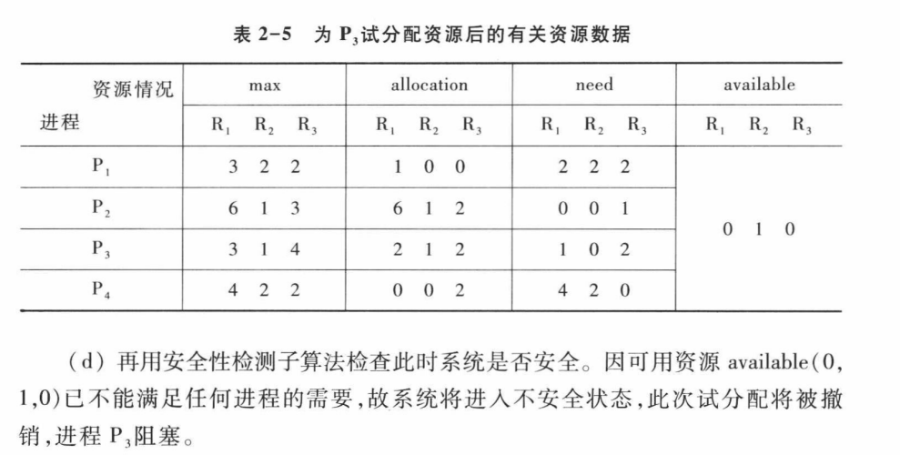
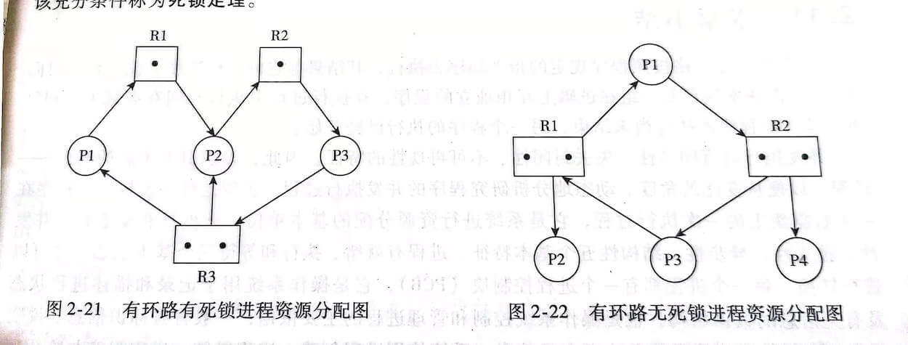

# 1. 什么是操作系统？

操作系统是一种计算机**系统软件**，它**管理**计算机**硬件和其他软件资源**，并提供了一系列**服务和接口**，使**用户和应用程序**能够与计算机进行**交互**。

操作系统通常有以下几个基本功能：

1. 管理计算机硬件资源，包括CPU、内存、输入输出设备、文件系统等；
2. 提供各种系统服务，如进程管理、内存管理、文件管理、网络管理、安全管理等；
3. 提供用户与计算机系统交互的接口，如命令行界面、图形用户界面、应用程序接口等。

# 2. 什么是系统调用

根据进程访问资源的特点，我们可以把进程在系统上的运行分为两个级别：

1. 用户态(user mode) : 用户态运行的进程可以直接读取用户程序的数据。
2. 系统态(kernel mode):可以简单的理解系统态运行的进程或程序几乎可以访问计算机的任何资源，不受限制。

说了用户态和系统态之后，那么什么是系统调用呢？

我们运行的程序基本都是运行在用户态，如果我们调用操作系统提供的系统态级别的子功能咋办呢？那就需要系统调用了！

也就是说在我们运行的用户程序中，凡是与系统态级别的资源有关的操作（如文件管理、进程控制、内存管理等)，都必须通过系统调用方式向操作系统提出服务请求，并由操作系统代为完成。

这些系统调用按功能大致可分为如下几类：

- 设备管理。完成设备的请求或释放，以及设备启动等功能。
- 文件管理。完成文件的读、写、创建及删除等功能。
- 进程控制。完成进程的创建、撤销、阻塞及唤醒等功能。
- 进程通信。完成进程之间的消息传递或信号传递等功能。
- 内存管理。完成内存的分配、回收以及获取作业占用内存区大小及地址等功能。

# 3. 进程与线程

**进程**：进程是计算机中正在运行的程序的实例，它是操作系统中进行资源分配和调度的基本单位。系统运行一个程序即是一个进程从创建，运行到消亡的过程。在 Java 中，当我们启动 main 函数时其实就是启动了一个 JVM 的进程，而 main 函数所在的线程就是这个进程中的一个线程，也称主线程。

**线程**：线程是计算机程序执行的最小单位，是操作系统中进程内的一个执行单元，一个进程可以包含多个线程。

> 区别：
>
> 1. **资源分配**：**进程是分配系统资源的基本单位**，包括内存、CPU时间、文件和设备等，每个进程都有独立的地址空间和资源；而**线程是进程内的执行单元**，**线程共享进程的资源和上下文环境**，如内存空间、打开的文件、信号处理等。
> 2. **切换代价**：**进程切换代价比较大**，需要保存和恢复进程的完整上下文信息，如寄存器状态、页表、文件描述符等，因此进程之间的切换时间相对较长；而**线程的切换代价较小**，只需要保存和恢复线程的少量上下文信息，如寄存器状态和栈指针，因此线程之间的切换时间相对较短。
> 3. **并发性**：**进程之间是相互独立的**，它们有自己的地址空间和资源，需要通过进程间通信（IPC）来实现数据共享和通信，因此**进程间并发性相对较低**；而**线程共享进程的资源和上下文环境**，可以直接访问进程内的数据，因此**线程之间并发性相对较高**。
> 4. 调试和**安全**：进程之间是相互独立的，它们有自己的地址空间和资源，因此进程间通信和调试相对容易；而线程共享进程的资源和上下文环境，线程之间的调试和**安全问题**更为复杂。

# 4. 进程有哪几种状态?

**创建状态(new)** ：进程正在被创建，尚未到就绪状态。

**就绪状态(ready)** ：进程已处于准备运行状态，即进程获得了除了处理器之外的一切所需资源，一旦得到处理器资源(处理器分配的时间片)即可运行。

**运行状态(running)** ：进程正在处理器上上运行(单核 CPU 下任意时刻只有一个进程处于运行状态)。

**阻塞状态(waiting)** ：又称为等待状态，进程正在等待某一事件而暂停运行如等待某资源为可用或等待 IO 操作完成。即使处理器空闲，该进程也不能运行。

**结束状态(terminated)**：进程正在从系统中消失。可能是进程正常结束或其他原因中断退出运行。

# 5. 进程间的通信方式

1. **管道/匿名管道(Pipes)** ：用于具有亲缘关系的父子进程间或者兄弟进程之间的通信。

2. **有名管道(Named Pipes)** : 有名管道严格遵循**先进先出(first in first out)**。有名管道以磁盘文件的方式存在，可以实现本机任意两个进程通信。
3. **信号(Signal)** ：信号是一种比较复杂的通信方式，用于通知接收进程某个事件已经发生；
4. **消息队列(Message Queuing)** ：消息队列可以实现消息的随机查询,消息不一定要以先进先出的次序读取,也可以按消息的类型读取.比 FIFO 更有优势。**消息队列克服了信号承载信息量少，管道只能承载无格式字 节流以及缓冲区大小受限等缺点。**
5. **信号量(Semaphores)** ：**信号量是一个计数器，用于多进程对共享数据的访问，信号量的意图在于进程间同步**。这种通信方式主要用于解决与同步相关的问题并避免竞争条件。
6. **共享内存(Shared memory)** ：使得多个进程可以访问同一块内存空间，不同进程可以及时看到对方进程中对共享内存中数据的更新。这种方式需要依靠某种同步操作，如互斥锁和信号量等。可以说这是**最有用**的进程间通信方式。
7. **套接字(Sockets)** : 此方法**主要用于在客户端和服务器之间通过网络进行通信**。套接字是支持 TCP/IP 的网络通信的基本操作单元，可以看做是不同主机之间的进程进行双向通信的端点，简单的说就是通信的两方的一种约定，用套接字中的相关函数来完成通信过程。

# 6. 线程间的同步的方式

线程同步是两个或多个共享关键资源的线程的并发执行。应该同步线程以避免关键的资源使用冲突。操作系统一般有下面三种线程同步的方式：

1. **互斥量(Mutex)**：采用互斥对象机制，只有拥有互斥对象的线程才有访问公共资源的权限。因为互斥对象只有一个，所以可以保证公共资源不会被多个线程同时访问。比如 Java 中的 synchronized 关键词和各种 Lock 都是这种机制。
2. **信号量(Semaphore)** ：它允许同一时刻多个线程访问同一资源，但是需要控制同一时刻访问此资源的最大线程数量。
3. **事件(Event)** :Wait/Notify：通过通知操作的方式来保持多线程同步，还可以方便的实现多线程优先级的比较操作。

# 7. 进程的调度算法

- **先到先服务(FCFS)调度算法** : 从就绪队列中选择一个最先进入该队列的进程为之分配资源，使它立即执行并一直执行到完成或发生某事件而被阻塞放弃占用 CPU 时再重新调度。

- **短作业优先(SJF)的调度算法** : 从就绪队列中选出一个估计运行时间最短的进程为之分配资源，使它立即执行并一直执行到完成或发生某事件而被阻塞放弃占用 CPU 时再重新调度。

- **时间片轮转调度算法** : 每个进程被分配一个时间段，称作它的时间片，即该进程允许运行的时间。

- **多级反馈队列调度算法** ：前面介绍的几种进程调度的算法都有一定的局限性。如**短进程优先的调度算法，仅照顾了短进程而忽略了长进程** 。多级反馈队列调度算法既能使高优先级的作业得到响应又能使短作业（进程）迅速完成。，因而它是目前**被公认的一种较好的进程调度算法**，UNIX 操作系统采取的便是这种调度算法。

- **优先级调度** ： 为每个流程分配优先级，首先执行具有最高优先级的进程，依此类推。具有相同优先级的进程以 FCFS 方式执行。可以根据内存要求，时间要求或任何其他资源要求来确定优先级。

# 8. 什么是死锁？

死锁描述的是这样一种情况：多个进程/线程同时被阻塞，它们中的一个或者全部都在等待某个资源被释放。由于进程/线程被无限期地阻塞，因此程序不可能正常终止。

# 9. 死锁的四个必要条件

- **互斥**：资源必须处于非共享模式，即一次只有一个进程可以使用。如果另一进程申请该资源，那么必须等待直到该资源被释放为止。
- **占有并等待**：一个进程至少应该占有一个资源，并等待另一资源，而该资源被其他进程所占有。
- **非抢占**：已经分配给某个进程（线程）的资源不能被其他进程（线程）强行抢占，只有该进程自愿释放。
- **循环等待**：有一组等待进程 `{P0, P1,..., Pn}`， `P0` 等待的资源被 `P1` 占有，`P1` 等待的资源被 `P2` 占有，......，`Pn-1` 等待的资源被 `Pn` 占有，`Pn` 等待的资源被 `P0` 占有。

# 10. 解决死锁的方法

解决死锁的方法可以从多个角度去分析，一般的情况下，有**预防，避免，检测和解除四种**。

- **预防**是采用某种策略，**限制并发进程对资源的请求**，从而使得死锁的必要条件在系统执行的任何时间上都不满足。
- **避免**则是系统在分配资源时，根据资源的使用情况**提前做出预测**，从而**避免死锁的发生**
- **检测**是指系统设有**专门的机构**，当死锁发生时，该机构能够检测死锁的发生，并精确地确定与死锁有关的进程和资源。
- **解除**是与检测相配套的一种措施，用于**将进程从死锁状态下解脱出来**。

## 10.1 死锁的预防

死锁四大必要条件上面都已经列出来了，很显然，只要破坏四个必要条件中的任何一个就能够预防死锁的发生。

1. 破坏互斥条件：对于不必须互斥的资源，可以允许多个进程（线程）同时访问，从而避免资源的独占性。
2. 破坏占有且等待条件：进程（线程）在申请资源时，要求申请到全部需要的资源才能执行，而不是申请到一部分资源就先占有，等待申请其它资源。
3. 破坏非抢占条件：当进程（线程）占有了某些资源，再去申请其它资源时，如果不能满足要求，就要释放已经占有的资源，以便别的进程（线程）使用。(剥夺式分配)
4. 破坏循环等待条件：**规定进程（线程）对资源的访问顺序**，按照同一顺序请求资源，释放资源时则按照相反的顺序来释放，这样就不会形成循环等待的情况。

## 10.2 死锁的避免

**银行家算法**：当一个进程申请使用资源的时候，银行家算法通过先 **试探** 分配给该进程资源，然后通过安全性算法判断分配后的系统是否处于安全状态，若不安全则试探分配作废，让该进程继续等待。

算法流程将用下面一张图来表示：

来个例子看看非常清晰：

## 10.3 死锁的检测

### 10.3.1 进程-资源分配图

操作系统中的每一刻时刻的**系统状态**都可以用**进程-资源分配图**来表示，进程-资源分配图是描述进程和资源申请及分配关系的一种有向图，可用于**检测系统是否处于死锁状态**。

方框表示每一个资源类，方框中的黑点表示该资源类中的各个资源，每个进程用一个圆圈表示，用 **有向边** 来表示**进程申请资源和资源被分配的情况**。

下图是**进程-资源分配图**的一个例子，其中共有三个资源类，每个进程的资源占有和申请情况已清楚地表示在图中。在这个例子中，由于存在 **占有和等待资源的环路** ，导致一组进程永远处于等待资源的状态，发生了 **死锁**。

程-资源分配图中存在环路并不一定是发生了死锁。因为循环等待资源仅仅是死锁发生的必要条件，而不是充分条件。上图便是一个有环路而无死锁的例子。虽然进程 P1 和进程 P3 分别占用了一个资源 R1 和一个资源 R2，并且因为等待另一个资源 R2 和另一个资源 R1 形成了环路，但进程 P2 和进程 P4 分别占有了一个资源 R1 和一个资源 R2，它们申请的资源得到了满足，在有限的时间里会归还资源，于是进程 P1 或 P3 都能获得另一个所需的资源，环路自动解除，系统也就不存在死锁状态了。

### 10.3.2 死锁检测步骤

- 如果进程-资源分配图中无环路，则此时系统没有发生死锁
- 如果进程-资源分配图中有环路，且每个资源类仅有一个资源，则系统中已经发生了死锁。
- 如果进程-资源分配图中有环路，且涉及到的资源类有多个资源，此时系统未必会发生死锁。如果能在进程-资源分配图中找出一个 **既不阻塞又非独立的进程** ，该进程能够在有限的时间内归还占有的资源，也就是把边给消除掉了，重复此过程，直到能在有限的时间内 **消除所有的边** ，则不会发生死锁，否则会发生死锁。(消除边的过程类似于 **拓扑排序**)

## 13.4 死锁的解除

当死锁检测程序检测到存在死锁发生时，应设法让其解除，让系统从死锁状态中恢复过来，常用的解除死锁的方法有以下四种：

1. **立即结束所有进程的执行，重新启动操作系统** ：这种方法简单，但以前所在的工作全部作废，损失很大。
2. **撤销涉及死锁的所有进程，解除死锁后继续运行** ：这种方法能彻底打破**死锁的循环等待**条件，但将付出很大代价，例如有些进程可能已经计算了很长时间，由于被撤销而使产生的部分结果也被消除了，再重新执行时还要再次进行计算。
3. **逐个撤销涉及死锁的进程，回收其资源直至死锁解除。**
4. **抢占资源** ：从涉及死锁的一个或几个进程中抢占资源，把夺得的资源再分配给涉及死锁的进程直至死锁解除。

# 14. 操作系统的内存管理主要是做什么？

操作系统的内存管理主要负责**内存的分配与回收**（malloc 函数：申请内存，free 函数：释放内存），另外**地址转换**也就是将逻**辑地址转换成相应的物理地址**等功能也是操作系统内存管理做的事情。

# 15. 常见的几种内存管理机制

简单分为**连续分配管理方式**和**非连续分配管理方式**这两种。连续分配管理方式是指为**一个用户程序分配一个连续的内存空间**，常见的如 **块式管理** 。同样地，非连续分配管理方式允许**一个程序使用的内存分布在离散或者说不相邻的内存中**，常见的如**页式管理** 和 **段式管理**。

1. **块式管理** ：将内存分为几个固定大小的块，每个块中只包含一个进程。如果程序运行需要内存的话，操作系统就分配给它一块，如果程序运行只需要很小的空间的话，分配的这块内存很大一部分几乎被浪费了。这些在每个块中未被利用的空间，我们称之为**碎片**。
2. **页式管理** ：把**主存**分为大小相等且固定的一页一页的形式，**页较小**，相比于块式管理的划分粒度更小，提高了内存利用率，减少了碎片。页式管理通过页表对应逻辑地址和物理地址。
3. **段式管理** ： 页式管理虽然提高了内存利用率，但是页式管理其中的页并无任何实际意义。 段式管理把主存分为一段段的，段是有实际意义的，每个段定义了一组逻辑信息，例如,有**主程序段** MAIN、**子程序段** X、**数据段** D 及**栈段** S 等。 段式管理通过**段表对应逻辑地址和物理地址**。
4. **段页式管理**：结合了段式管理和页式管理的优点，简单来说段页式管理机制就是把主存先分成若干段，每个段又分成若干页，也就是说 **段页式管理机制** 中**段与段之间以及段的内部的都是离散**的。

# 16. 快表和多级页表

这两个东西分别解决了页表管理中很重要的两个问题：

1. 虚拟地址到物理地址的转换要快。
2. 解决虚拟地址空间大，页表也会很大的问题

## 16.1 快表

为了提高虚拟地址到物理地址的转换速度，操作系统在 **页表方案** 基础之上引入了 **快表** 来加速虚拟地址到物理地址的转换。我们可以把快表理解为一种特殊的高速缓冲存储器（Cache），由于采用页表做地址转换，读写内存数据时 CPU 要访问两次主存。有了快表，有时只要访问一次高速缓冲存储器，一次主存，这样可加速查找并提高指令执行速度。

> 在使用页式内存管理机制时，由于**虚拟地址被分成了页号和页内偏移量**两部分，需要通过页表将页号转换为物理页框号，才能访问实际的物理内存。因此，读写内存数据时，CPU需要访问两次主存：第一次是访问页表，将虚拟地址的页号转换为物理页框号，第二次才是访问实际的物理内存，进行数据读写操作。

使用快表之后的地址转换流程是这样的：

1. 根据虚拟地址中的页号查快表；
2. 如果该页在快表中，直接从快表中读取相应的物理地址；
3. 如果该页不在快表中，就访问内存中的页表，再从页表中得到物理地址，同时将页表中的该映射表项添加到快表中；
4. 当快表填满后，又要登记新页时，就按照一定的淘汰策略淘汰掉快表中的一个页。

## 16.2 多级页表

引入多级页表的主要目的是为了避免把全部页表一直放在内存中占用过多空间，特别是那些根本就不需要的页表就不需要保留在内存中。

多级页表属于**时间换空间**的典型场景。

# 17. 分页机制和分段机制的共同点和区别

1. **共同点** ： 
   - 分页机制和分段机制都是为了提高内存利用率，减少内存碎片。
   - 页和段都是离散存储的，所以两者都是离散分配内存的方式。但是，每个页和段中的内存是连续的。
2. **区别** ： 
   - 页的大小是固定的，由操作系统决定；而段的大小不固定，取决于我们当前运行的程序。
   - 分页仅仅是为了满足操作系统内存管理的需求，而段是逻辑信息的单位，在程序中可以体现为代码段，数据段，能够更好满足用户的需要。

# 18. 逻辑(虚拟)地址和物理地址

- 逻辑地址：**操作系统或应用程序面对的存储单元地址的表示形式**。段式管理方式把内存划分为多个逻辑段（代码段、数据段、堆栈段等），从而把不同的数据存储 隔离开。它的描述形式是**段号：偏移地址**
  1. 段号：用来查找段的起始地址，它被存储在段寄存器中
  2. 偏移地址/有效地址：**对于该段的起始地址的偏移量**
- 物理地址：是指真实的物理内存中地址，它由两部分组成：**页框号和页内偏移量**。在使用页式内存管理机制时，物理地址是通过将虚拟地址的页号转换为物理页框号来得到的。

# 19. CPU 寻址了解吗?为什么需要虚拟地址空间?

## 19.1 CPU 寻址

CPU寻址是指CPU通过某种方式来访问内存中的数据或指令。在计算机系统中，**CPU寻址通常使用地址总线和数据总线来实现**。**CPU通过地址总线将要访问的内存地址传递给内存控制器，内存控制器会将这个地址和数据总线上的数据交换**，从而完成对内存的读取或写入操作。

CPU的寻址方式主要有以下几种：

1. 直接寻址。直接将要访问的内存地址**存储在指令中**，CPU直接将这个地址发送给内存控制器。
2. 间接寻址。将要访问的内存**地址存储在一个寄存器中**，CPU先访问这个寄存器获取地址，再将地址发送给内存控制器。
3. 寄存器寻址。将要访问的**数据存储在一个寄存器中**，CPU直接访问这个寄存器获取数据。
4. 基址寻址。将要访问的数据的地址是一个**基地址加上一个偏移量**，CPU先访问一个基址寄存器获取基地址，再加上一个偏移量得到要访问的地址。
5. 变址寻址。将要访问的数据的地址是**一个基地址加上一个偏移量加上一个变址寄存器中的值**，CPU先访问一个基址寄存器获取基地址，再加上一个偏移量和一个变址寄存器中的值得到要访问的地址。

## 19.2 为什么需要虚拟地址空间

1. 保护进程的内存空间。虚拟地址空间可以为每个进程分配独立的地址空间，从而保护进程的内存空间不被其他进程访问或破坏。(有点像代理的角色)
2. 提供更大的地址空间。虚拟地址空间可以比实际的物理地址空间大得多，这样就可以为应用程序提供更大的地址空间，从而支持更复杂的应用程序。
3. 简化内存管理。通过虚拟地址空间，操作系统可以将物理内存映射到虚拟地址空间中，从而可以方便地管理内存。
4. 允许多道程序并发执行。虚拟地址空间可以为每个进程分配独立的地址空间，从而允许多个进程并发执行，提高了计算机系统的资源利用率。

# 20. 什么是虚拟内存(Virtual Memory)?

这个在我们平时使用电脑特别是 Windows 系统的时候太常见了。很多时候我们使用了很多占内存的软件，这些软件占用的内存可能已经远远超出了我们电脑本身具有的物理内存。**为什么可以这样呢？** 正是因为 **虚拟内存** 的存在，通过 **虚拟内存** 可以让程序拥有超过系统物理内存大小的可用内存空间。另外，**虚拟内存为每个进程提供了一个一致的、私有的地址空间，它让每个进程产生了一种自己在独享主存的错觉（每个进程拥有一片连续完整的内存空间）**。这样会更加有效地管理内存并减少出错。

**虚拟内存**是计算机系统内存管理的一种技术，我们可以手动设置自己电脑的虚拟内存。不要单纯认为虚拟内存只是“使用硬盘空间来扩展内存“的技术。**虚拟内存的重要意义是它定义了一个连续的虚拟地址空间**，并且 **把内存扩展到硬盘空间**。

> 为解决该问题，[Windows](https://baike.baidu.com/item/Windows?fromModule=lemma_inlink)中运用了虚拟[内存](https://baike.baidu.com/item/内存?fromModule=lemma_inlink)技术，即匀出一部分硬盘空间来充当内存使用。当内存耗尽时，电脑就会自动调用硬盘来充当内存，以缓解内存的紧张。

# 21. 局部性原理

局部性原理（Locality Principle）是计算机科学中一个基本的概念，它指出程序在执行过程中访问内存的地址具有一定的局部性特征，即**程序在一段时间内倾向于访问一部分内存地址，而不是均匀地访问内存的所有地址**。局部性原理通常包括两种类型：

1. **时间局部性**（Temporal Locality）：如果一个内存地址被访问过一次，那么在不久的将来这个地址还可能被再次访问，即程序**往往会访问刚刚被使用过的数据和指令**。
2. **空间局部性**（Spatial Locality）：如果一个内存地址被访问过一次，那么在不久的将来和它相邻的内存地址也很可能被访问，即程序**往往会访问紧邻着刚刚被使用过的数据和指令**。

时间局部性是通过**将近来使用的指令和数据保存到高速缓存存储器**中，并使用高速缓存的层次结构实现。空间局部性通常是使用较大的高速缓存，并将**预取机制**集成到高速缓存控制逻辑中实现。虚拟内存技术实际上就是建立了 “内存一外存”的两级存储器的结构，利用局部性原理实现髙速缓存。

# 22. 虚拟存储器

>**虚拟存储器又叫做虚拟内存，都是 Virtual Memory 的翻译，属于同一个概念。**

基于局部性原理，在程序装入时，可以将程序的一部分装入内存，而将其他部分留在外存，就可以启动程序执行。由于外存往往比内存大很多，所以我们运行的软件的内存大小实际上是可以比计算机系统实际的内存大小大的。在程序执行过程中，当所访问的信息不在内存时，由操作系统将所需要的部分调入内存，然后继续执行程序。另一方面，操作系统将内存中暂时不使用的内容换到外存上，从而腾出空间存放将要调入内存的信息。这样，计算机好像为用户提供了一个比实际内存大得多的存储器——**虚拟存储器**。

# 23. 虚拟内存的技术实现

## 23.1 实现方式

**虚拟内存的实现需要建立在离散分配的内存管理方式的基础上。** 虚拟内存的实现有以下三种方式：

- **请求分页存储管理** ：建立在分页管理之上，为了支持虚拟存储器功能而增加了**请求调页功能和页面置换功能**。请求分页是目前最常用的一种实现虚拟存储器的方法。请求分页存储管理系统中，在作业开始运行之前，仅装入当前要执行的部分段即可运行。假如在作业运行的过程中发现要访问的页面不在内存，则由处理器通知操作系统按照对应的**页面置换算法**将相应的页面调入到主存，同时操作系统也可以将暂时不用的页面置换到外存中。
- **请求分段存储管理** ：建立在分段存储管理之上，增加了**请求调段功能、分段置换功能**。请求分段储存管理方式就**如同请求分页储存管理方式一样**，在作业开始运行之前，仅装入当前要执行的部分段即可运行；在执行过程中，可使用请求调入中断动态装入要访问但又不在内存的程序段；当内存空间已满，而又需要装入新的段时，根据置换功能适当调出某个段，以便腾出空间而装入新的段。
- **请求段页式存储管理**

## 23.2 请求分页与分页存储管理

请求分页存储管理建立在分页管理之上。他们的根本区别是是否将程序所需的全部地址空间都装入主存，这也是请求分页存储管理可以提供虚拟内存的原因。

不管是上面那种实现方式，我们一般都需要：

1. 一定容量的**内存和外存**：在载入程序的时候，只需要将程序的一部分装入内存，而将其他部分留在外存，然后程序就可以执行了；
2. **缺页中断**：如果**需执行的指令或访问的数据尚未在内存**（称为缺页或缺段），则由处理器通知操作系统将相应的页面或段**调入到内存**，然后继续执行程序；
3. **虚拟地址空间** ：逻辑地址到物理地址的变换。

# 24. 页面置换算法

地址映射过程中，若在页面中发现所要访问的页面不在内存中，则发生缺页中断 。

> **缺页中断** 就是要访问的**页**不在主存，需要操作系统将其调入主存后再进行访问。 在这个时候，被内存映射的文件实际上成了一个分页交换文件。

当发生缺页中断时，如果当前内存中并没有空闲的页面，操作系统就必须在内存选择一个页面将其移出内存，以便为即将调入的页面让出空间。用**来选择淘汰哪一页的规则叫做页面置换算法**，我们可以把页面置换算法看成是淘汰页面的规则。

- **OPT 页面置换算法（最佳页面置换算法）** ：最佳(Optimal, OPT)置换算法所选择的被淘汰页面将是以后**永不使用**的，或者是在**最长时间内不再被访问的**页面，这样可以保证获得最低的缺页率。但由于人们目前无法预知进程在内存下的若千页面中哪个是未来最长时间内不再被访问的，因而**该算法无法实现**。**一般作为衡量其他置换算法的方法**。
- **FIFO（First In First Out） 页面置换算法（先进先出页面置换算法）** : 总是淘汰最先进入内存的页面，即选择在内存中**驻留时间最久**的页面进行淘汰。
- **LRU （Least Recently Used）页面置换算法（最近最久未使用页面置换算法）** ：LRU 算法赋予每个页面一个访问字段，用来记录一个页面自上次被访问以来所经历的时间 T，当须淘汰一个页面时，选择现有页面中其 T 值最大的，即最近最久未使用的页面予以淘汰。
- **LFU （Least Frequently Used）页面置换算法（最少使用页面置换算法）** : 该置换算法选择在之前时期使用最少的页面作为淘汰页。