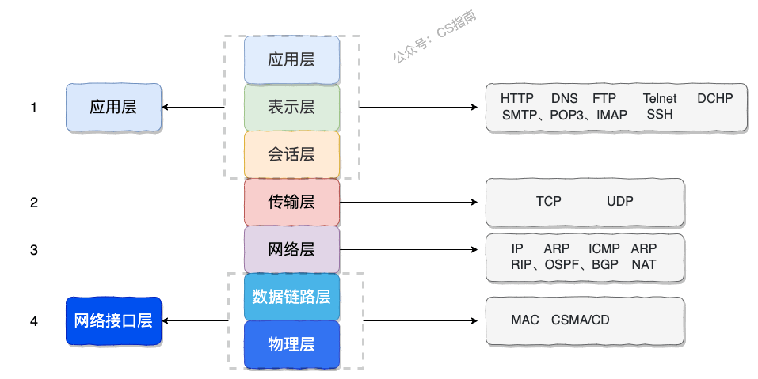
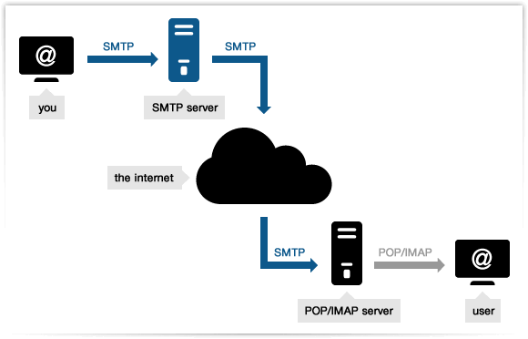
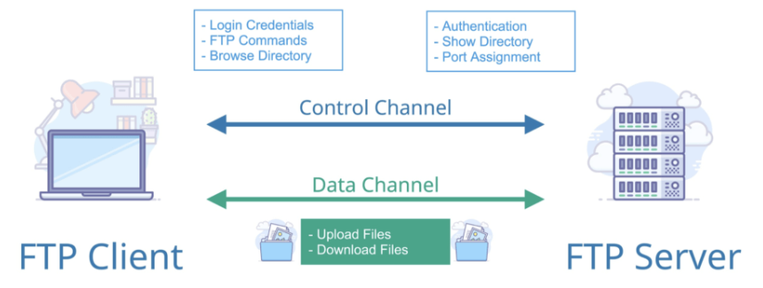
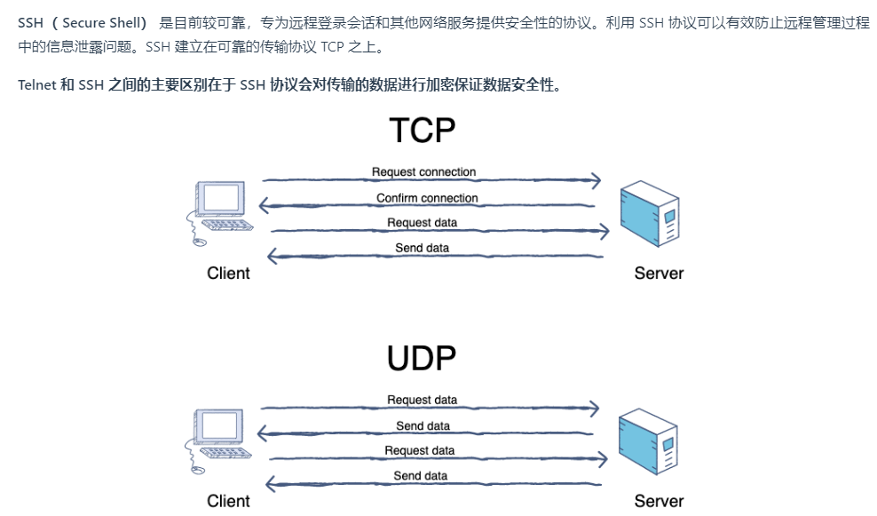
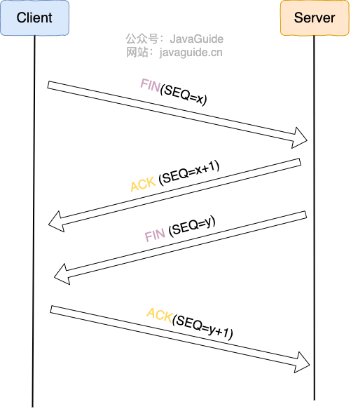

# 1. OSI七层模型

# 2. TCP/IP 四层模型

 

1. 网络接口层（Network Interface Layer）：网络接口层负责将数据从数据链路层传输到物理层，同时处理数据在传输媒介（如以太网或无线电波）上的传输和接收。
2. 网际层（Internet Layer）：网际层提供了网络的核心功能，它负责将数据从源地址传输到目标地址。网际层使用IP协议确定数据的路由路径，并处理分组转发和路由选择。
3. 传输层（Transport Layer）：传输层提供了端到端的通信服务，负责将数据从一个进程传递到另一个进程。它使用TCP协议提供可靠的传输和流量控制服务，或使用UDP协议提供无连接的传输服务。
4. 应用层（Application Layer）：应用层是最高层，它为用户提供网络服务，并处理应用程序之间的通信。例如，HTTP协议、FTP协议、SMTP协议和DNS协议都是应用层协议。

**应用层协议** :

- HTTP 协议（超文本传输协议，网页浏览常用的协议）
- DHCP 协议（动态主机配置）
- DNS 系统原理（域名系统）
- FTP 协议（文件传输协议）
- Telnet协议（远程登陆协议）
- 电子邮件协议等（SMTP、POP3、IMAP）
- ......

**传输层协议** :

- TCP 协议 
  - 报文段结构
  - 可靠数据传输
  - 流量控制
  - 拥塞控制
- UDP 协议 
  - 报文段结构
  - RDT（可靠数据传输协议）

**网络层协议** :

- IP 协议（TCP/IP 协议的基础，分为 IPv4 和 IPv6）
- ARP 协议（地址解析协议，用于解析 IP 地址和 MAC 地址之间的映射）
- ICMP 协议（控制报文协议，用于发送控制消息）
- NAT 协议（网络地址转换协议）
- RIP 协议、OSPF 协议、BGP 协议（路由选择协议）
- ......

**网络接口层** :

- 差错检测技术
- 多路访问协议（信道复用技术）
- CSMA/CD 协议
- MAC 协议
- 以太网技术

# 3. 网络分层的原因

**各层之间相互独立**：各层之间相互独立，各层之间不需要关心其他层是如何实现的，只需要知道自己如何调用下层提供好的功能就可以了（可以简单理解为接口调用）**。这个和我们对开发时系统进行分层是一个道理。**

**提高了整体灵活性** ：每一层都可以使用最适合的技术来实现，你只需要保证你提供的功能以及暴露的接口的规则没有改变就行了。**这个和我们平时开发系统的时候要求的高内聚、低耦合的原则也是可以对应上的。**

**大问题化小** ： 分层可以将复杂的网络问题分解为许多比较小的、界线比较清晰简单的小问题来处理和解决。这样使得复杂的计算机网络系统变得易于设计，实现和标准化。 **这个和我们平时开发的时候，一般会将系统功能分解，然后将复杂的问题分解为容易理解的更小的问题是相对应的，这些较小的问题具有更好的边界（目标和接口）定义。

# 4. 应用层常见协议总结

## 4.1 HTTP:超文本传输协议

**超文本传输协议（HTTP，HyperText Transfer Protocol)** 主要是为 Web 浏览器与 Web 服务器之间的通信而设计的。当我们使用浏览器浏览网页的时候，我们网页就是通过 HTTP 请求进行加载的，整个过程如下图所示。

HTTP 协是基于 TCP协议，发送 HTTP 请求之前首先要建立 TCP 连接也就是要经历 3 次握手。目前使用的 HTTP 协议大部分都是 1.1。在 1.1 的协议里面，默认是开启了 Keep-Alive 的，这样的话建立的连接就可以在多次请求中被复用了。

另外， HTTP 协议是”**无状态**”的协议，它无法记录客户端用户的状态，一般我们都是通过 Session 来记录客户端用户的状态。

## 4.2 SMTP:简单邮件传输(发送)协议

**简单邮件传输(发送)协议（SMTP，Simple Mail Transfer Protocol）** 基于 TCP 协议，用来发送电子邮件。

**接受邮件的协议不是 SMTP 而是 POP3 协议。**

### 4.2.1 电子邮件的发送过程？

比如我的邮箱是“dabai@cszhinan.com”，我要向“xiaoma@qq.com”发送邮件，整个过程可以简单分为下面几步：

1. 通过 **SMTP** 协议，我将我写好的邮件交给163邮箱服务器（邮局）。
2. 163邮箱服务器发现我发送的邮箱是qq邮箱，然后它使用 SMTP协议将我的邮件转发到 qq邮箱服务器。
3. qq邮箱服务器接收邮件之后就通知邮箱为“xiaoma@qq.com”的用户来收邮件，然后用户就通过 **POP3/IMAP** 协议将邮件取出。

### 4.2.2 如何判断邮箱是真正存在的？

很多场景(比如邮件营销)下面我们需要判断我们要发送的邮箱地址是否真的存在，这个时候我们可以利用 SMTP 协议来检测：

1. 查找邮箱域名对应的 SMTP 服务器地址
2. 尝试与服务器建立连接
3. 连接成功后尝试向需要验证的邮箱发送邮件
4. 根据返回结果判定邮箱地址的真实性

## 4.3 POP3/IMAP:邮件接收的协议

这两个协议没必要多做阐述，只需要了解 **POP3 和 IMAP 两者都是负责邮件接收的协议**即可。另外，需要注意不要将这两者和 SMTP 协议搞混淆了。**SMTP 协议只负责邮件的发送，真正负责接收的协议是POP3/IMAP。**

IMAP 协议相比于POP3更新一点，为用户提供的可选功能也更多一点,几乎所有现代电子邮件客户端和服务器都支持IMAP。大部分网络邮件服务提供商都支持POP3和IMAP。

## 4.4 FTP:文件传输协议

**FTP 协议** 主要提供文件传输服务，基于 TCP 实现可靠的传输。使用 FTP 传输文件的好处是可以屏蔽操作系统和文件存储方式。

FTP 是基于客户—服务器（C/S）模型而设计的，在客户端与 FTP 服务器之间建立两个连接：

1. 控制连接：用于传送控制信息（命令和响应）
2. 数据连接：用于数据传送；

这种将命令和数据分开传送的思想大大提高了 FTP 的效率。

## 4.5 Telnet:远程登陆协议

**Telnet 协议** 通过一个终端登陆到其他服务器，建立在可靠的传输协议 TCP 之上。Telnet 协议的最大缺点之一是所有数据（包括用户名和密码）均以明文形式发送，这有潜在的安全风险。这就是为什么如今很少使用Telnet并被一种称为SSH的非常安全的协议所取代的主要原因。

## 4.6 SSH:安全的网络传输协议

**SSH（ Secure Shell）** 是目前较可靠，专**为远程登录会话和其他网络服务提供安全性的协议**。利用 SSH 协议可以有效防止远程管理过程中的信息泄露问题。SSH 建立在可靠的传输协议 TCP 之上。

**Telnet 和 SSH 之间的主要区别在于 SSH 协议会对传输的数据进行加密保证数据安全性。**

# 5. TCP 与 UDP 的区别

1. **是否面向连接** ：UDP 在传送数据之前不需要先建立连接。而 TCP 提供面向连接的服务，在传送数据之前必须先建立连接，数据传送结束后要释放连接。
2. **是否是可靠传输**：远地主机在收到 UDP 报文后，不需要给出任何确认，并且不保证数据不丢失，不保证是否顺序到达。TCP 提供可靠的传输服务，TCP 在传递数据之前，会有三次握手来建立连接，而且在数据传递时，有确认、窗口、重传、拥塞控制机制。通过 TCP 连接传输的数据，无差错、不丢失、不重复、并且按序到达。
3. **是否有状态** ：这个和上面的“是否可靠传输”相对应。TCP 传输是有状态的，这个有状态说的是 TCP 会去记录自己发送消息的状态比如消息是否发送了、是否被接收了等等。为此 ，TCP 需要维持复杂的连接状态表。而 UDP 是无状态服务，简单来说就是不管发出去之后的事情了。
4. **传输效率** ：由于使用 TCP 进行传输的时候多了连接、确认、重传等机制，所以 TCP 的传输效率要比 UDP 低很多。
5. **传输形式** ： TCP 是面向字节流的，UDP 是面向报文的。
6. **首部开销** ：TCP 首部开销（20 ～ 60 字节）比 UDP 首部开销（8 字节）要大。
7. **是否提供广播或多播服务** ：TCP 只支持点对点通信，UDP 支持一对一、一对多、多对一、多对多；

|                        | TCP            | UDP        |
| ---------------------- | -------------- | ---------- |
| 是否面向连接           | 是             | 否         |
| 是否可靠               | 是             | 否         |
| 是否有状态             | 是             | 否         |
| 传输效率               | 较慢           | 较快       |
| 传输形式               | 字节流         | 数据报文段 |
| 首部开销               | 20 ～ 60 bytes | 8 bytes    |
| 是否提供广播或多播服务 | 否             | 是         |

# 6. 什么时候选择 TCP，什么时候选 UDP?

- **UDP 一般用于即时通信**，比如： 语音、 视频 、直播等等。这些场景对传输数据的准确性要求不是特别高，比如你看视频即使少个一两帧，实际给人的感觉区别也不大。
- **TCP 用于对传输准确性要求特别高的场景**，比如文件传输、发送和接收邮件、远程登录等等。

# 7. HTTP 基于 TCP 还是 UDP？

HTTP 3.0 之前是基于 TCP 协议的，而 HTTP3.0 将弃用 TCP，改用 **基于 UDP 的 QUIC 协议** 。此变化主要为了解决 HTTP/2 中存在的队头阻塞问题。由于 HTTP/2 在单个 TCP 连接上使用了多路复用，受到 TCP 拥塞控制的影响，少量的丢包就可能导致整个 TCP 连接上的所有流被阻塞。

# 8. 使用 TCP 的协议有哪些?使用 UDP 的协议有哪些?

**运行于 TCP 协议之上的协议** ：

1. **HTTP 协议** ：超文本传输协议（HTTP，HyperText Transfer Protocol)主要是为 Web 浏览器与 Web 服务器之间的通信而设计的。当我们使用浏览器浏览网页的时候，我们网页就是通过 HTTP 请求进行加载的。
2. **HTTPS 协议** ：更安全的超文本传输协议(HTTPS,Hypertext Transfer Protocol Secure)，身披 SSL 外衣的 HTTP 协议
3. **FTP 协议**：文件传输协议 FTP（File Transfer Protocol），提供文件传输服务，**基于 TCP** 实现可靠的传输。使用 FTP 传输文件的好处是可以屏蔽操作系统和文件存储方式。
4. **SMTP 协议**：简单邮件传输协议（SMTP，Simple Mail Transfer Protocol）的缩写，**基于 TCP 协议**，用来发送电子邮件。注意 ⚠️：接受邮件的协议不是 SMTP 而是 POP3 协议。
5. **POP3/IMAP 协议**： POP3 和 IMAP 两者都是负责邮件接收的协议。
6. **Telnet 协议**：远程登陆协议，通过一个终端登陆到其他服务器。被一种称为 SSH 的非常安全的协议所取代。
7. **SSH 协议** : SSH（ Secure Shell）是目前较可靠，专为远程登录会话和其他网络服务提供安全性的协议。利用 SSH 协议可以有效防止远程管理过程中的信息泄露问题。SSH 建立在可靠的传输协议 TCP 之上。

**运行于 UDP 协议之上的协议** ：

1. **DHCP 协议**：动态主机配置协议，动态配置 IP 地址
2. **DNS** ： **域名系统（DNS，Domain Name System）将人类可读的域名 (例如，www.baidu.com) 转换为机器可读的 IP 地址 (例如，220.181.38.148)。** 我们可以将其理解为专为互联网设计的电话薄。实际上 DNS 同时支持 UDP 和 TCP 协议。

# 9. TCP 三次握手和四次挥手

## 9.1 建立连接-TCP 三次握手

建立一个 TCP 连接需要“三次握手”，缺一不可 ：

- **一次握手**:客户端发送带有 SYN（SEQ=x） 标志的数据包 -> 服务端，然后客户端进入 **SYN_SEND** 状态，等待服务器的确认；
- **二次握手**:服务端发送带有 SYN+ACK(SEQ=y,ACK=x+1) 标志的数据包 –> 客户端,然后服务端进入 **SYN_RECV** 状态
- **三次握手**:客户端发送带有 ACK(ACK=y+1) 标志的数据包 –> 服务端，然后客户端和服务器端都进入**ESTABLISHED** 状态，完成TCP三次握手。 

## 9.2 为什么要三次握手?

三次握手的目的是**建立可靠的通信信道**，说到通讯，简单来说就是数据的发送与接收，而三次握手最主要的目的就是双方确认自己与对方的发送与接收是正常的。

三次握手的目的是建立可靠的通信信道，说到通讯，简单来说就是数据的发送与接收，而三次握手最主要的目的就是双方确认自己与对方的发送与接收是正常的。

1. **第一次握手** ：Client 什么都不能确认；Server 确认了对方发送正常，自己接收正常
2. **第二次握手** ：Client 确认了：自己发送、接收正常，对方发送、接收正常；Server 确认了：对方发送正常，自己接收正常
3. **第三次握手** ：Client 确认了：自己发送、接收正常，对方发送、接收正常；Server 确认了：自己发送、接收正常，对方发送、接收正常

## 9.3 第2次握手传回了ACK，为什么还要传回SYN？

服务端传回发送端所发送的 ACK 是为了告诉客户端：“我接收到的信息确实就是你所发送的信号了”，这表明从客户端到服务端的通信是正常的。回传 SYN 则是为了**建立并确认从服务端到客户端的通信**。

> SYN 同步序列编号(Synchronize Sequence Numbers) 是 TCP/IP 建立连接时使用的握手信号。在客户机和服务器之间建立正常的 TCP 网络连接时，客户机首先发出一个 SYN 消息，服务器使用 SYN-ACK 应答表示接收到了这个消息，最后客户机再以 ACK(Acknowledgement）消息响应。这样在客户机和服务器之间才能建立起可靠的 TCP 连接，数据才可以在客户机和服务器之间传递。

## 9.4 断开连接-TCP 四次挥手

断开一个 TCP 连接则需要“四次挥手”，缺一不可 ：

1. **第一次挥手** ：客户端发送一个 FIN（SEQ=X） 标志的数据包->服务端，用来关闭客户端到服务器的数据传送。然后，客户端进入 **FIN-WAIT-1** 状态。

2. **第二次挥手** ：服务器收到这个 FIN（SEQ=X） 标志的数据包，它发送一个 ACK （SEQ=X+1）标志的数据包->客户端 。然后，此时服务端进入**CLOSE-WAIT**状态，客户端进入**FIN-WAIT-2**状态,但是仍然可以接收客户端的数据。

3. **第三次挥手** ：等双方收发数据都完成之后，服务端关闭与客户端的连接并发送一个 FIN (SEQ=y)标志的数据包->客户端请求关闭连接，然后，服务端进入**LAST-ACK**状态。

4. **第四次挥手** ：客户端发送 ACK (SEQ=y+1)标志的数据包->服务端并且进入**TIME-WAIT**状态，服务端在收到 ACK (SEQ=y+1)标志的数据包后进入 CLOSE 状态。此时，如果客户端等待 **2MSL** 后依然没有收到回复，就证明服务端已正常关闭，随后，客户端也可以关闭连接了。

   >2MSL是指两倍的报文段最长寿命  （Maximum Segment Lifetime）1

## 9.5 为什么要四次挥手？

**TCP是全双工通信，可以双向传输数据**。任何一方都可以在数据传送结束后发出连接释放的通知，待对方确认后进入半关闭状态。当另一方也没有数据再发送的时候，则发出连接释放通知，对方确认后就完全关闭了 TCP 连接。

举个例子：A 和 B 打电话，通话即将结束后。

1. **第一次挥手** ： A 说“我没啥要说的了”
2. **第二次挥手** ：B 回答“我知道了”，但是 B 可能还会有要说的话，A 不能要求 B 跟着自己的节奏结束通话
3. **第三次挥手** ：于是 B 可能又巴拉巴拉说了一通，最后 B 说“我说完了”
4. **第四次挥手** ：A 回答“知道了”，这样通话才算结束。

## 9.6 为什么不能把服务器发送的 ACK 和 FIN 合并起来，变成三次挥手？

因为服务器收到客户端断开连接的请求时，可能还有一些数据没有发完，这时先回复 ACK，表示接收到了断开连接的请求。等到数据发完之后再发 FIN，断开服务器到客户端的数据传送。

## 9.7 如果第二次挥手时服务器的 ACK 没有送达客户端，会怎样？

客户端没有收到 ACK 确认，会重新发送 FIN 请求。

## 9.8 为什么第四次挥手客户端需要等待 2*MSL（报文段最长寿命）时间后才进入 CLOSED 状态？

第四次挥手时，客户端发送给服务器的 ACK 有可能丢失，如果服务端因为某些原因而没有收到 ACK 的话，服务端就会重发 FIN，如果客户端在 2*MSL 的时间内收到了 FIN，就会重新发送 ACK 并再次等待 2MSL，防止 Server 没有收到 ACK 而不断重发 FIN。

> **MSL(Maximum Segment Lifetime)** : 一个片段在网络中最大的存活时间，2MSL 就是一个发送和一个回复所需的最大时间。如果直到 2MSL，Client 都没有再次收到 FIN，那么 Client 推断 ACK 已经被成功接收，则结束 TCP 连接。

# 10. 从输入URL 到页面展示到底发生了什么？

1. DNS解析：浏览器首先会尝试从本地DNS缓存中查找域名对应的IP地址。如果找不到，浏览器会向本地DNS服务器发送请求，获取对应的IP地址。如果本地DNS服务器也没有记录该域名对应的IP地址，则会向根域名服务器发起请求，根据域名的层级结构依次向下查找，直到找到对应的IP地址。

   

2. TCP连接：[三次握手](#9.1 建立连接-TCP 三次握手)讲出来。

3. 发送HTTP请求：TCP连接建立成功后，**浏览器会向服务器发送HTTP请求**。HTTP请求中包含了要访问的资源的信息，例如URL、请求方法、请求头等。

4. 服务器处理请求并响应：服务器接收到HTTP请求后，会根据请求中的信息，对请求进行处理，并**生成一个HTTP响应**。HTTP响应中包含了要返回的资源的内容，例如HTML文件、图片、脚本等。同时，HTTP响应中还包含了状态码、响应头等信息。

5. 浏览器解析响应内容：浏览器接收到服务器返回的HTTP响应后，会解析响应内容。如果响应中包含了HTML文件，浏览器会根据HTML文档中的标记，解析出网页的结构和内容。同时，浏览器还会根据CSS和JavaScript等资源，对网页进行渲染和交互处理。

6. 页面渲染：浏览器根据HTML文件和相关资源，对页面进行渲染，将页面展示出来。

# 11. HTTP 状态码有哪些？

## 11.1 2xx Success（成功状态码）

- **200 OK** ：请求被成功处理。比如我们发送一个查询用户数据的HTTP 请求到服务端，服务端正确返回了用户数据。这个是我们平时最常见的一个 HTTP 状态码。
- **201 Created** ：请求被成功处理并且在服务端创建了一个新的资源。比如我们通过 POST 请求创建一个新的用户。
- **202 Accepted** ：服务端已经接收到了请求，但是还未处理。
- **204 No Content** ： 服务端已经成功处理了请求，但是没有返回任何内容

## 11.2 3xx Redirection（重定向状态码）

- **301 Moved Permanently** ： 资源被永久重定向了。比如你的网站的网址更换了。
- **302 Found** ：资源被临时重定向了。比如你的网站的某些资源被暂时转移到另外一个网址。

## 11.3 4xx Client Error（客户端错误状态码）

- **400 Bad Request** ： 发送的HTTP请求存在问题。比如请求参数不合法、请求方法错误。

  > 实际开发中遇到的：
  >
  > - 请求参数错误，比如格式、数据类型等

- **401 Unauthorized** ： 未认证却请求需要认证之后才能访问的资源。

- **403 Forbidden** ：直接拒绝HTTP请求，不处理。一般用来针对非法请求，**一般是权限问题**。

  > 实际开发中遇到的：
  >
  > - 使用nginx反向代理访问服务上的文件，如果服务器上的文件或目录权限设置不正确，就会出现403错误。

- **404 Not Found** ： 你请求的资源未在服务端找到。

  > 实际开发中遇到的：
  >
  > - 接口名称拼写错误
  > - 前端访问某些资源文件不存在或没找到

- **409 Conflict** ： 表示请求的资源与服务端当前的状态存在冲突，请求无法被处理。

## 11.4 5xx Server Error（服务端错误状态码）

- **500 Internal Server Error** ： 服务端出问题了（通常是服务端出Bug了）。比如你服务端处理请求的时候突然抛出异常，但是异常并未在服务端被正确处理，比如空指针异常没有被处理。

- **502 Bad Gateway** ： 产生错误的原因是连接超时，我们向服务器发送请求，由于服务器当前链接太多或网络不流畅，导致服务器方面无法给于正常的响应，产生此类报错。

  > nginx做代理时需要访问上有服务器，但是上游服务器没有给出响应（疾控项目经常遇到）

  